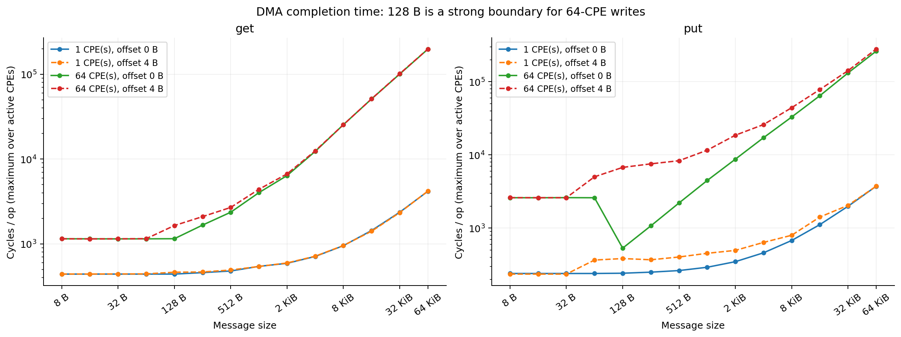
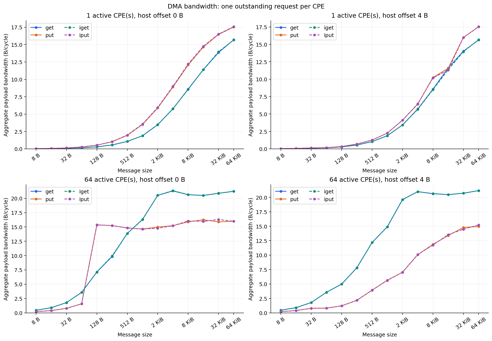
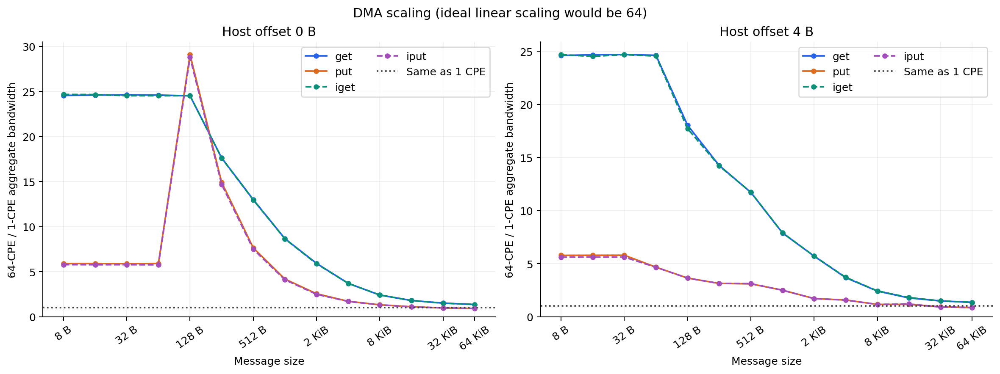
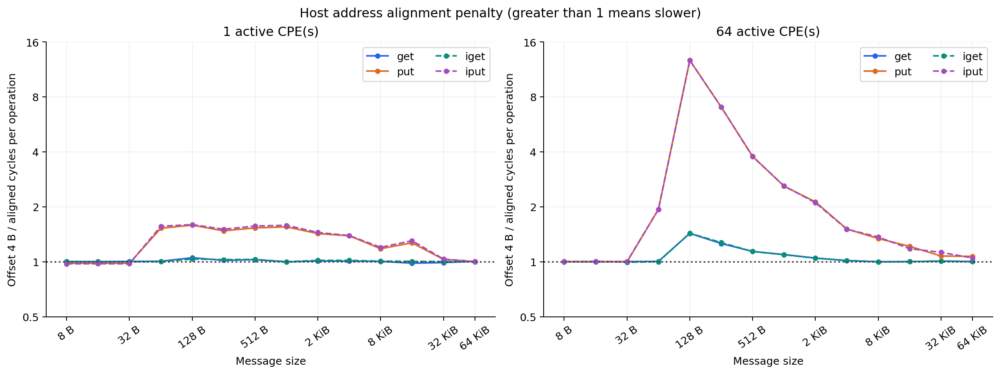
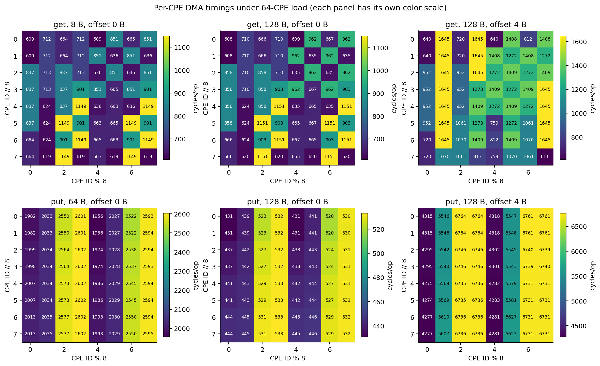

# DMA 实测结果分析

数据集：`dma_results_20261005_183213_10036`；作业 8419757，队列 `q_share`，2026-10-05。分析不编译、不提交或执行神威程序。

## 1. 结论

1. 数据完整：8 项正确性检查、224 项正式扫描、112 组扩展比均通过独立复核。共检查 7540 条逐核记录，所有报告的错误为 0，汇总值与原始 CSV 一致。
2. 大消息下，64 核读取聚合带宽在约 20.5–21.3 B/cycle，写入在约 15–16.3 B/cycle。单核带宽随消息增大逐渐接近共享资源的有效吞吐上限，增加核数的收益随之缩小。
3. 最强的边界是 **128 B 对齐写入**：64 核 put 从对齐 64 B 的 1.574 B/cycle，跳到对齐 128 B 的 15.367 B/cycle。地址加 4 B 后，128 B 写入吞吐降到 1.211 B/cycle，耗时约为对齐时的 12.69 倍。
4. iget 与 get 基本一致，iput 与 put 的差别也很小。这套实现中每次非阻塞操作之后立即等待，未测试流水化或计算通信重叠。
5. **平台识别：**本次 `cpuinfo.txt` 报告 `cpu revision: sw39000`，SPE 频率 2250 MHz。记录应标为该运行环境报告的 SW39000，不能直接作为 SW26010Pro 的性能参数。

## 2. 数据来源、单位和测量口径

主要数据来自 `summary.csv`，并逐项追溯 `raw/*.csv`；`scaling.csv` 的 112 个比值也重新计算。测试口径依据本次结果目录的 `source/dma_slave.c`、`source/dma_host.c` 和 `source/bench_common.h`，而非当前可能已修改的源码。环境依据 `build_info.txt`、`compute.txt`、`cpuinfo.txt`。

- get/iget：主存 → 本核 LDM；put/iput：本核 LDM → 主存。
- 消息 8 B–64 KiB，1 或 64 个活跃从核，主存偏移 0/4 B。偏移 4 B 仍满足 4 B 对齐，不满足 128 B 对齐；LDM 缓冲始终 128 B 对齐。
- 每核仅一个未完成请求，8 次预热不计时；小于 1 KiB 的消息重复 10000 次，其余重复 1000 次。屏障在计时循环外；计时不含主核初始化、spawn/join、校验、CSV 输出。
- 每次传输复用该核同一主存槽和同一 LDM 缓冲。槽间距 65664 B，64 核使用互不重叠的区域；每个主存分配约 4.008 MiB。这是预热后重复访问模式，未扫描更大的轮转工作集。
- `cycles_per_op` 在 summary 中是 **64 核中最大累计周期 / reps**，不是 64 核平均耗时。聚合带宽为 `S × reps × active / max(cycles)`，以计时前共同屏障后的各核局部区间近似整体吞吐。
- SACA 手册 PDF 第 60 页对供应方完成的定义是“数据已从本从核的 LDM 取走”。因此 put/iput 计时的完成边界不应额外解释成每次物理 DRAM 写入都已落地；主核的最终内容校验在 join 之后完成。

原始单位保留 **cycles、B/cycle**。`cpuinfo.txt` 的 `spe frequency [MHz]: 2250` 允许提供条件换算：如果该计数器按报告的 2.25 GHz SPE 频率递增，则 `ns = cycles / 2.25`，`GB/s = B/cycle × 2.25`（十进制）。手册 PDF 第 88 页称该接口为本从核周期计数器，但本次没有进行计数器频率独立标定；以下 ns/GB/s 均依此条件换算，图表使用原始单位。

## 3. 单核小消息：操作完成开销

对齐情况下，小消息的完成耗时有明显平台区间：

| 模式 | 取值区间 | cycles/op 范围 | 区间中位数换算 ns（按 2.25 GHz） |
| --- | --- | --- | --- |
| get | 8–128 B | 440.63–440.88 | 195.92 |
| put | 8–64 B | 240.12–240.28 | 106.76 |
| iget | 8–128 B | 440.54–441.18 | 195.89 |
| iput | 8–64 B | 234.18–234.26 | 104.10 |

读取约 441 cycles，写入约 234–240 cycles。两者含循环、模式判断、接口和应答等待开销，可作为当前 API 实现下的微基准基线，不等同于纯硬件启动延迟。先前 10 次诊断得到 1258 cycles/op，本次正式小消息扫描为 10000 次，应以正式扫描值描述这个测试配置。

## 4. 带宽曲线和并发扩展

64 KiB、主存对齐时：

| 模式 | 单核 B/cycle | 64 核聚合 B/cycle | 64/1 带宽比 | 64 核 GB/s（按 2.25 GHz） |
| --- | --- | --- | --- | --- |
| get | 15.697 | 21.229 | 1.352× | 47.77 |
| put | 17.526 | 16.001 | 0.913× | 36.00 |
| iget | 15.675 | 21.213 | 1.353× | 47.73 |
| iput | 17.574 | 15.982 | 0.909× | 35.96 |

64 核读取在 4–64 KiB 的范围约 20.50–21.34 B/cycle，形成较平的吞吐区间。64 核写入在 8–64 KiB 约 15.89–16.30 B/cycle。它们是本次单核组、单未完成请求、固定槽访问条件下的有效载荷吞吐，不代表全芯片或理论主存峰值。

对齐时的代表性扩展比：

| 消息 | get：64/1 | put：64/1 |
| --- | --- | --- |
| 8 B | 24.55× | 5.90× |
| 64 B | 24.59× | 5.91× |
| 128 B | 24.51× | 29.09× |
| 1 KiB | 8.66× | 4.18× |
| 4 KiB | 3.70× | 1.71× |
| 16 KiB | 1.80× | 1.11× |
| 32 KiB | 1.51× | 0.96× |
| 64 KiB | 1.35× | 0.91× |

小消息能通过并发隐藏每核请求开销，但没有达到 64 倍扩展。大消息时，单核已经接近该访问模式下的共享吞吐上限，64 核读取只比单核高约 35%。64 KiB 写入的聚合带宽反而低于单核约 9%，符合争用与请求调度开销的表现；仅凭这组数据无法区分内存控制器、DMA 注入、互连、缓存一致性或特定地址映射各自的贡献。

## 5. 128 B 边界及主存偏移

64 核、阻塞接口的对照：

| 模式 | 消息 B | 对齐 B/cycle | 偏移 4 B：B/cycle | 偏移/对齐耗时 | 带宽下降 |
| --- | --- | --- | --- | --- | --- |
| get | 128 | 7.117 | 4.979 | 1.43× | 30.0% |
| get | 4096 | 21.290 | 20.997 | 1.01× | 1.4% |
| get | 65536 | 21.229 | 21.172 | 1.00× | 0.3% |
| put | 64 | 1.574 | 0.814 | 1.93× | 48.3% |
| put | 128 | 15.367 | 1.211 | 12.69× | 92.1% |
| put | 256 | 15.240 | 2.167 | 7.03× | 85.8% |
| put | 4096 | 15.226 | 10.078 | 1.51× | 33.8% |
| put | 65536 | 16.001 | 14.960 | 1.07× | 6.5% |

最值得建模的是写入的非线性边界：

- 对齐 64 B → 128 B：传输量加倍，最大 cycles/op 却从 2602.50 降到 533.08，聚合带宽增加约 9.76 倍。
- 128 B 写入、偏移 4 B：带宽下降约 92.1%；iput 同样呈现约 12.67 倍耗时，两个接口表现吻合。
- 读取的偏移影响小得多：64 核 get 在 128 B 时耗时增加约 42.9%，带宽下降约 30.0%；4 KiB 及以上影响通常很小。
- 写入偏移影响随消息变大整体减弱，但并非严格单调；64 KiB put 的带宽仍下降约 6.5%。单核 put/iput 的小中消息偏移代价也很明显。

SACA 手册 PDF 第 59 页明确说明：DMA 主存访问会拆成 128 B 请求，不对界地址会拆出更多请求。这与本次读写的边界现象相符。额外分段可以解释一部分偏移代价，但 **仅靠多一个分段不能充分解释 128 B 写入约 12.7 倍耗时**。部分块写入的处理方式、共享资源争用等是后续待区分的机制；本次结果不能证明具体内部路径，也不能将手册中针对从核 cache 写回的读改写说明直接套到 DMA。

## 6. 阻塞与非阻塞接口

以下比值使用主存对齐的 14 种消息大小：

| 活跃核数 | 带宽比 | 14 个点的范围 | 14 个点的中位数 |
| --- | --- | --- | --- |
| 1 | iget/get | 0.9954–1.0106 | 1.0007 |
| 1 | iput/put | 1.0028–1.0260 | 1.0153 |
| 64 | iget/get | 0.9952–1.0093 | 1.0002 |
| 64 | iput/put | 0.9824–1.0259 | 0.9991 |

get/iget 差异基本在约 1% 内。单核 iput 相对 put 通常高约 1–2%，64 核两者仍很接近。由于每次 iget/iput 后立即等待，不能据此得出异步 DMA 没有价值；这组数据只说明 **单未完成请求、立即等待** 时接口本身的差别很小。各配置只有一次独立计时区间，不给这些微小差异赋予统计显著性。

## 7. 逐核差异

64 核、主存对齐的逐核平均 cycles/op：

| 模式 | 消息 B | 最小 | 中位数 | 最大 | 核间变异系数 |
| --- | --- | --- | --- | --- | --- |
| get | 8 | 608.93 | 712.50 | 1148.61 | 21.48% |
| get | 4096 | 12300.41 | 12310.23 | 12312.99 | 0.03% |
| put | 64 | 1955.81 | 2278.31 | 2602.50 | 12.38% |
| put | 128 | 430.85 | 483.24 | 533.08 | 9.14% |
| put | 65536 | 249566.89 | 258852.68 | 262131.17 | 1.77% |

小消息核间差异明显，例如 get 8 B 的最大值约为最小值的 1.89 倍。put 的 64 B 与 128 B 在核编号上都有重复的带状差异。get 4 KiB 时逐核耗时则十分接近，符合大消息受共同瓶颈约束的表现。

热图仅将编号按 `id=8r+c` 排列。每个格子是该核全部重复操作的平均值，不是逐次采样的延迟分位数；核间变异系数也不是测量误差或置信区间。地址按固定步长随编号变化，物理内存映射、请求调度和从核位置可能混在一起，**不能把这些 DMA 图当作 RMA 的 2×2 router 拓扑证据**。

## 8. 可用于后续模拟器的初步参数

在主存 128 B 对齐条件下，对大消息区域拟合 `T(S)=alpha+beta*S`，T 单位为 cycles/op，S 单位为 B。单核选 1–64 KiB 的 7 个点，64 核选 4–64 KiB 的 5 个点；不混合两种活跃核数或两种偏移。64 核使用 summary 中的最大逐核完成耗时，斜率对应的聚合有效带宽为 `64/beta`。

| 模式 | 核数 | 拟合消息区间 | alpha cycles | beta cycles/B | 斜率对应聚合 B/cycle | R² |
| --- | --- | --- | --- | --- | --- | --- |
| get | 1 | 1–64 KiB | 490.07 | 0.056475 | 17.71 | 0.999845 |
| get | 64 | 4–64 KiB | 975.84 | 3.008649 | 21.27 | 0.999870 |
| put | 1 | 1–64 KiB | 240.36 | 0.053403 | 18.73 | 0.999998 |
| put | 64 | 4–64 KiB | 257.84 | 3.997542 | 16.01 | 0.999938 |
| iget | 1 | 1–64 KiB | 487.70 | 0.056492 | 17.70 | 0.999897 |
| iget | 64 | 4–64 KiB | 919.77 | 3.011378 | 21.25 | 0.999879 |
| iput | 1 | 1–64 KiB | 235.01 | 0.053329 | 18.75 | 0.999998 |
| iput | 64 | 4–64 KiB | 6.44 | 3.990349 | 16.04 | 0.999848 |

这些拟合用于近似本次配置内的大消息趋势。读取单核的拟合截距约 490 cycles，略高于小消息平台约 441 cycles；64 核 iput 的截距接近零，是有限区间线性拟合的结果，不能解释成物理启动延迟为零。模型应分开保存小消息基线、对齐状态和负载条件，尤其不能用一个 alpha/beta 覆盖写入的 128 B 跃迁。

建议当前先保留三个要素：**单核小消息完成开销、1/64 核的大消息吞吐、128 B 对齐与部分块写入代价**。本次仅有 1/64 核两个负载端点，尚不足以确定吞吐随活跃核数变化的完整函数。

## 9. 数据的适用范围与后续测量

本次结果已能描述当前平台的 DMA 性能结构。用于论文或模拟器校准前，仍需补齐：

1. 每个配置的多次独立测量和运行顺序变化；目前循环重复次数较多，但不是多次独立实验，没有跨运行置信区间。`q_share` 队列名称本身不能证明独占或共享程度。
2. 64/96/124/128/132/192/252/256/260 B 的细粒度尺寸，以及 0/4/64/124 B 主存偏移，定位 128 B 写入边界。所有大小和偏移继续满足手册的 4 B 限制。
3. 活跃核数 1/2/4/8/16/32/64，确定共享吞吐何时饱和；改变主存槽步长或随机化槽与核的对应关系，区分位置与地址映射。
4. iget/iput 的独立缓冲流水化、多个未完成请求窗口，以及轮转主存工作集，分别测队列能力和更大的主存访问范围。
5. 保存实际 cache/LDM 配置、资源分配及计数器频率标定。若研究目标仍为 SW26010Pro，先确认当前机器型号与该目标的关系，再决定能否迁移参数。

以上是后续实验建议，本次分析未执行任何新的神威测试。
