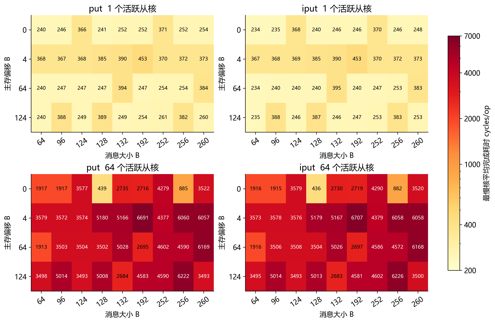
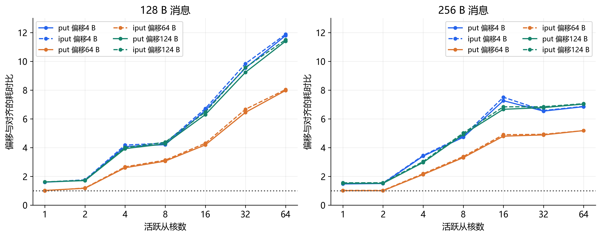
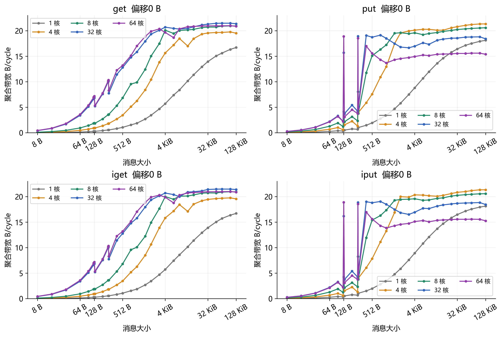
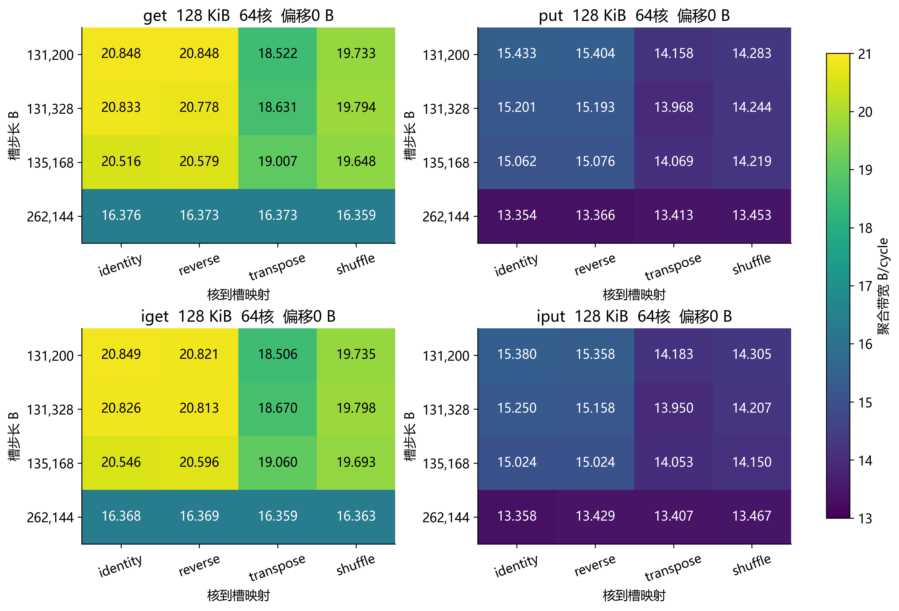

SW39000 DMA 扩展实验结果分析

实验日期 2026年10月5日    作业 8420952    队列 q_share

本次扩展实验确认，对齐写入在 128 B 与 256 B 处存在明显性能优势，偏移代价会随活跃核数放大。默认槽布局下，大消息 put 在 4 个活跃核附近取得本组最高吞吐，64 核比该测量峰值低约 28%。更换主存槽布局会改变吞吐，逐核读取和写入还呈现不同的地址关联与核位置关联，后续模型需要分别处理。

## 1  实验配置与完整性复核

| 项目 | 本次记录 |
| --- | --- |
| 运行环境 | cpu revision 为 sw39000  编译器 swgcc/1473 |
| 消息与负载 | 8 B 至 128 KiB  活跃核数 1 2 4 8 16 32 64 |
| Cache 与 LDM | 提交请求 -cache_size 0  静态 LDM 132840 B 共享 LDM 实际配置未确认 |
| 分组数量 | boundary 1008  load 1680  mapping 7168 |
| 完整性复核 | 9856 正式案例  8 正确性案例  179,076 逐核记录 |
| 汇总交叉检查 | 8448 扩展比与效率记录  原始数据和汇总一致  errors 均为 0 |

核 ID 固定为 0 至 N−1。边界组扫描 64、96、124、128、132、192、252、256、260 B 与 0、4、64、124 B 主存偏移。映射组扫描四种步长与 identity、reverse、transpose、shuffle 四种排列，随机种子为 20261005。

### 计时定义和适用范围

每项先预热 8 次；小于 1 KiB 重复 10000 次，其余重复 1000 次。每核仅保留一个未完成请求，iget/iput 也在每次发起后立即等待。屏障、分配、初始化、spawn/join、校验和输出位于计时区外。

cycles/op = 活跃核最大累计周期 ÷ 重复次数。聚合带宽 = N × 消息字节数 × 重复次数 ÷ 最大累计周期，单位为 B/cycle；它基于各核本地计时，并非另行测量的全组共同起止时间。

cpuinfo 报告 SPE 2250 MHz，但周期计数器尚未独立标定。本文以原始周期和 B/cycle 为准；仅在计数器确实按 2.25 GHz 递增的条件下，GB/s = B/cycle × 2.25。q_share 名称不能证明独占，资源共享程度仍未知。

上一批 64 KiB 基线的默认槽步长为 65664 B，本次为 131200 B，且本次显式记录 Cache 请求为 0。两批并非单因素对照，绝对带宽变化不能仅归因于消息上限扩大。

## 2  写入的大小与偏移边界

图 1  put 与 iput 的九种尺寸和四种偏移细扫  数值为 cycles/op

| 64核 put 消息 B | 偏移0 B | 偏移4 B | 偏移64 B | 偏移124 B |
| --- | --- | --- | --- | --- |
| 64 | 1916.82 | 3578.60 | 1913.48 | 3498.34 |
| 124 | 3577.09 | 3573.98 | 3504.05 | 3492.66 |
| 128 | 439.42 | 5179.92 | 3502.36 | 5008.27 |
| 132 | 2735.08 | 5166.38 | 5027.86 | 2684.06 |
| 252 | 4279.26 | 4376.84 | 4602.30 | 4589.93 |
| 256 | 885.38 | 6060.12 | 4590.04 | 6222.33 |
| 260 | 3521.90 | 6057.30 | 6169.40 | 3493.38 |

64 核对齐 put 的 128 B 耗时为 439.42 cycles/op，而相邻 124 B 与 132 B 分别为 3577.09 与 2735.08。256 B 对齐也出现同类低谷，说明转折并非简单的消息越大越慢。

## 3  偏移代价随负载放大

图 2  相同消息下偏移地址相对对齐地址的耗时比  虚线为 iput

| 模式与核数 | 消息 B | 偏移4 B 耗时比 | 偏移64 B 耗时比 | 偏移124 B 耗时比 |
| --- | --- | --- | --- | --- |
| put  1核 | 128 | 1.599 | 1.023 | 1.614 |
| put  64核 | 128 | 11.788 | 7.970 | 11.398 |
| put  1核 | 256 | 1.475 | 1.007 | 1.516 |
| put  64核 | 256 | 6.845 | 5.184 | 7.028 |
| get  64核 | 128 | 1.389 | 1.390 | 1.391 |

128 B 的 put 偏移 4 B 代价从单核约 1.60 倍放大到 64 核约 11.79 倍；后者带宽下降 91.5%。同尺寸 get 的 64 核偏移代价仅约 1.39 倍，读写路径需要分开解释。

### 仅靠覆盖的 128 B 块数仍不足以解释写入

64 B 偏移 0 B 与 96 B 偏移 4 B 都位于单个 128 B 地址块内，但 64 核 put 耗时分别约为 1916.82 和 3571.86 cycles/op，相差约 1.86 倍。另一方面，64 B 偏移 64 B 耗时约 1913.48 cycles/op，接近偏移 0 B。起点、终点及片段大小也影响写入，不能把额外覆盖一个块直接等价为固定惩罚。

这些现象支持对齐整块与部分块路径、并发争用等候选解释；目前未测硬件事务、bank/channel 或仲裁事件，尚不能确定是读改写、哪级缓存或某个互连部件导致。

## 4  扩展到 128 KiB 的带宽曲线

图 3  四种 DMA 模式的对齐传输带宽  展示五档活跃核数

| 模式 | 128KiB 单核 B/cycle | 128KiB 64核 B/cycle | 64核与单核 带宽比 |
| --- | --- | --- | --- |
| get | 16.705 | 20.851 | 1.248 |
| put | 18.120 | 15.381 | 0.849 |
| iget | 16.704 | 20.864 | 1.249 |
| iput | 18.137 | 15.254 | 0.841 |

单核 get 从 64 KiB 的 15.614 增到 128 KiB 的 16.705 B/cycle，增幅 7.0%；put 的相应增幅仅 3.5%。固定负载下大消息接近平台区，扩大消息并未带来成倍吞吐收益。

64 核 get 在 32 至 128 KiB 约为 20.85 至 20.98 B/cycle；put 约为 15.38 至 15.60 B/cycle。这是本布局下的有效载荷吞吐，不是全芯片或理论主存峰值。

## 5  中间核数揭示写入的吞吐下降

图 4  七档活跃核数的聚合吞吐  消息大小决定饱和和争用表现

| 活跃核数 | get 128KiB B/cycle | put 128KiB B/cycle | put 对4核 吞吐比 |
| --- | --- | --- | --- |
| 1 | 16.705 | 18.120 | 0.850 |
| 2 | 16.878 | 18.741 | 0.879 |
| 4 | 19.511 | 21.326 | 1.000 |
| 8 | 20.918 | 20.577 | 0.965 |
| 16 | 21.115 | 20.471 | 0.960 |
| 32 | 21.361 | 18.407 | 0.863 |
| 64 | 20.851 | 15.381 | 0.721 |

128 KiB 对齐 put 的本组最高值位于 4 核，为 21.326 B/cycle；64 核降至 15.381，比 4 核低 27.9%，也比单核低 15.1%。get 在 8 核已经达到该尺寸本组峰值的 95%，32 核最高，但 8、16、32、64 核之间只有几个百分点差异。

该结论针对固定活跃 ID 与默认槽步长。4 核 ID 为 0、1、2、3，并非几何 2×2 的 0、1、8、9；因此不能将 4 核峰值归因于小簇，也不能用于证明 RMA router 共享结构。

## 6  槽步长和核到地址排列影响吞吐

图 5  128 KiB 对齐消息的 64 核槽布局对照  所有排列复用相同缓冲基地址

| 模式 | 默认步长 identity | 默认步长 transpose | 262144 B identity | 16布局最大与 最小带宽比 |
| --- | --- | --- | --- | --- |
| get | 20.848 | 18.522 | 16.376 | 1.274 |
| put | 15.433 | 14.158 | 13.354 | 1.156 |

128 KiB、64 核 get 在默认步长的 identity 布局为 20.848 B/cycle，步长改为 262144 B 后为 16.376，下降 21.5%。固定默认步长但改为 transpose 后下降 11.2%；相应 put 下降 8.3%。

两端固定基地址分别为 0x500001406000 与 0x500002408000。64 核时固定步长下更换排列保持地址集合不变，仍出现吞吐差异，说明核到地址的配对关系参与了性能形成。核数小于 64 时排列也改变地址子集，应谨慎区分这两个因素。

改变步长会改变地址间距、页/地址集合和访问范围，不能视为已控制的物理 bank 实验。虚拟地址并不能确定实际 DRAM bank/channel；本数据支持布局敏感性，尚未定位具体映射函数。

## 7  小消息读取的耗时模式跟随地址槽

图 6  get 256 B  64核  偏移0 B  步长131200 B  上排按核 下排按槽重排

| 映射对 identity | 按核ID的 Pearson r | 按地址槽的 Pearson r |
| --- | --- | --- |
| reverse | -0.1667 | 0.9999 |
| transpose | -0.0656 | 0.9996 |
| shuffle | -0.0895 | 0.9996 |

换映射后，按核 ID 观察的快慢模式明显改变；将同一组耗时重新按地址槽号排列后，三种映射均与 identity 高度一致。按槽的相关系数约为 0.9996 至 0.9999，按核约为 −0.17 至 −0.07。这个案例的主要逐核差异更倾向于与主存地址槽关联。

这里同一地址槽对应的是相同虚拟地址及同一进程中的缓冲区，已排除单纯由 tid 编号固定产生全部模式的解释。但尚无法区分内存映射、地址相关路由或其他与地址绑定的资源。大消息 get 的相关性更复杂，不能把本案例推广成所有读取都只由地址决定。

下排的 8×8 仅将槽号按 slot=8r+c 重新排版，不是内存的物理二维拓扑；上排也仅按软件核 ID 展示。Pearson r 是描述性相似度，不是独立重复的显著性检验。

## 8  大消息写入保留核位置相关模式

图 7  put 128 KiB  64核  偏移0 B  步长131200 B
上排按核 下排按槽  色条单位为千 cycles/op

| 映射对 identity | 按核ID的 Pearson r | 按地址槽的 Pearson r |
| --- | --- | --- |
| reverse | 0.9998 | -0.8171 |
| transpose | 0.9789 | -0.0005 |
| shuffle | 0.9760 | -0.0890 |

这个写入案例中，换槽后上排的耗时模式仍相近：按核 ID 的相关系数为 0.9760 至 0.9998；按地址槽重排后，相似性反而减弱。相比上一页的 256 B 读取，它更支持核位置、注入或调度等与 CPE 绑定因素参与逐核差异。

吞吐与模式相似度应分开理解：即使各核的相对快慢排序相近，transpose 与 shuffle 的聚合吞吐仍低于 identity；地址配对仍能改变整体完成速度。固定核因素与地址因素可能同时存在，相关性并未证明具体部件或传输路线。

也不是所有 put 都呈现这一模式：例如 64 B 写入，reverse 与 identity 的按核相关系数约为 −0.81，按槽约为 0.83。写入应按消息规模和对齐条件分别分析，不能仅用一个“核位置惩罚”解释所有数据。

### 对体系结构建模的直接含义

建议至少区分读与写、整块与部分块、消息大小、活跃核集合、槽步长和映射。现阶段可以使用这些测量条件下的分段拟合或查表；跨布局或跨型号预测仍需验证。本实验没有发起 CPE 间 RMA，不能据此生成小簇通信参数。

## 9  跨阶段复测和结论的稳定程度

图 8  左为同配置跨阶段变化  右为匹配配置的非阻塞接口相对变化

| 匹配阶段 | 匹配组数 | 绝对变化中位数 | 绝对变化P90 | 绝对变化最大 |
| --- | --- | --- | --- | --- |
| boundary→load | 504 | 0.098% | 0.735% | 7.64% |
| load→mapping | 448 | 0.108% | 0.682% | 6.53% |

匹配项使用相同模式、大小、核数、偏移、默认步长和 identity 映射。绝对变化定义为 |BW后/BW前−1|。它们是同一作业内不同阶段的复测，执行顺序固定；虽显示多数配置相近，却不等价于独立作业重复、随机运行顺序或置信区间。几个百分点的细小差异应留待复测。

420 组匹配配置中，iget/get 带宽比中位数为 1.0006，iput/put 为 1.0005。非阻塞接口立即等待时，没有呈现稳定的整体吞吐优势；这不能用于评估多个未完成请求的流水收益。

### 后续验证的优先级

优先用多次独立作业、随机化配置顺序和实际资源共享记录复测写入边界、4 核与 64 核大消息差异及两类逐核模式。随后改变活跃核集合，在保持地址集合可比的条件下比较行、列和 2×2 位置；再测独立缓冲的请求窗口与轮转主存工作集，并标定计数器频率。

### 数据和复现入口

原始目录为 dma_results_20261005_203552_32484。主要依据包括 source 中的主从核源码、plan.csv、slot_maps.csv、raw、study_summary.csv、study_scaling.csv、build_info.txt 和 cpuinfo.txt；作业编号来自 job.log，compute.txt 中作业环境变量未提供编号。

复核脚本为 bench/analyze_dma_study.py。衍生表保存在 outputs/dma_study_analysis_20261005_203552_32484，含边界对照、负载峰值、布局对照、阶段复测和相关性记录。接口语义参照目录内《SACA编程指南》DMA 章节及《神威众核编程指南》2.4、3.4、4.1、4.3 节。
