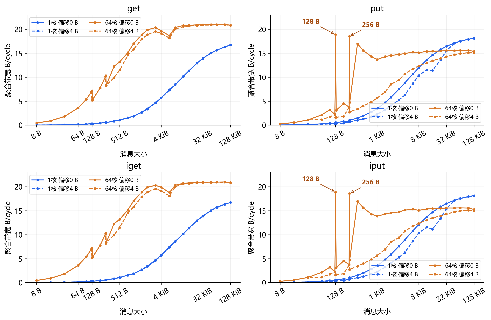
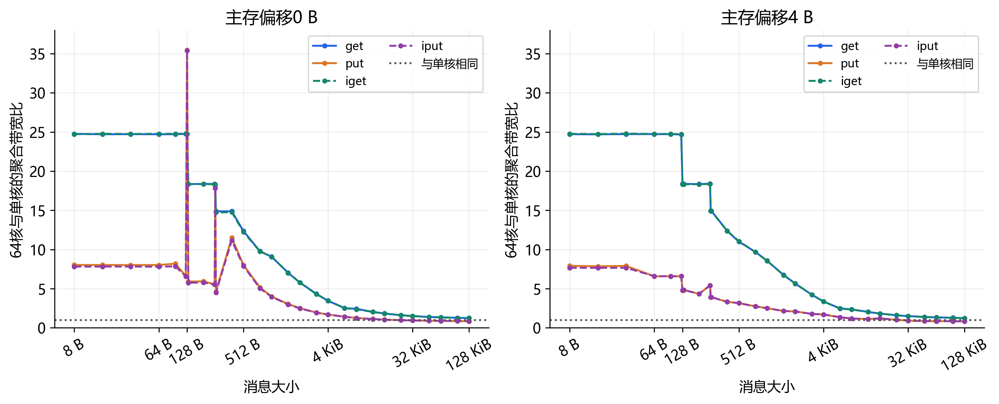
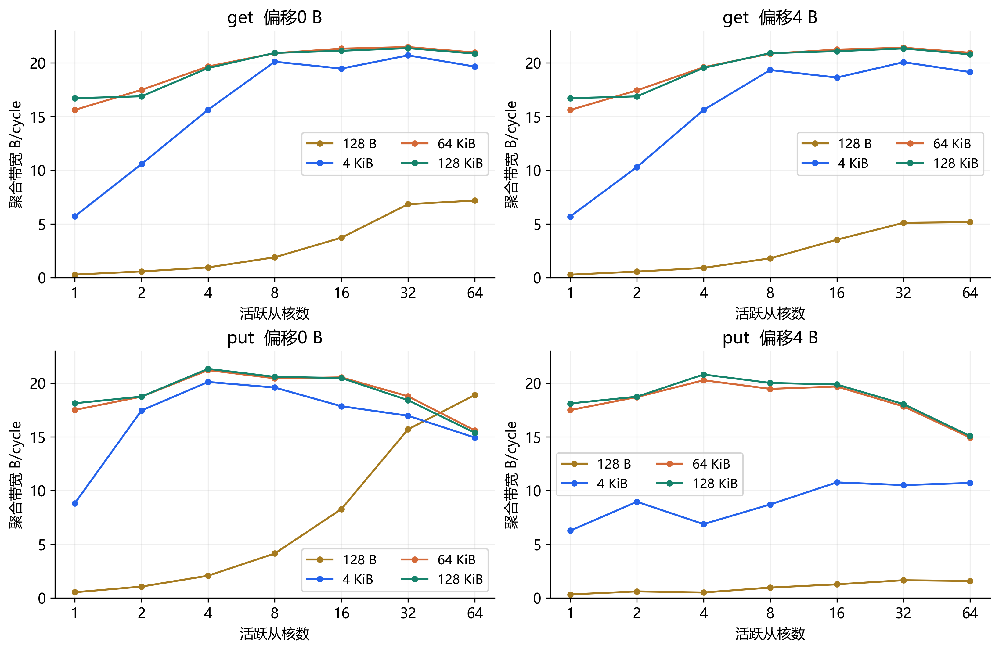
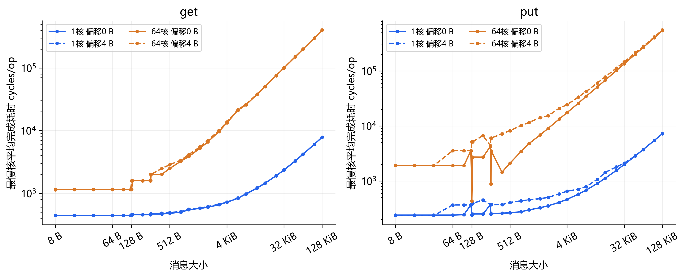
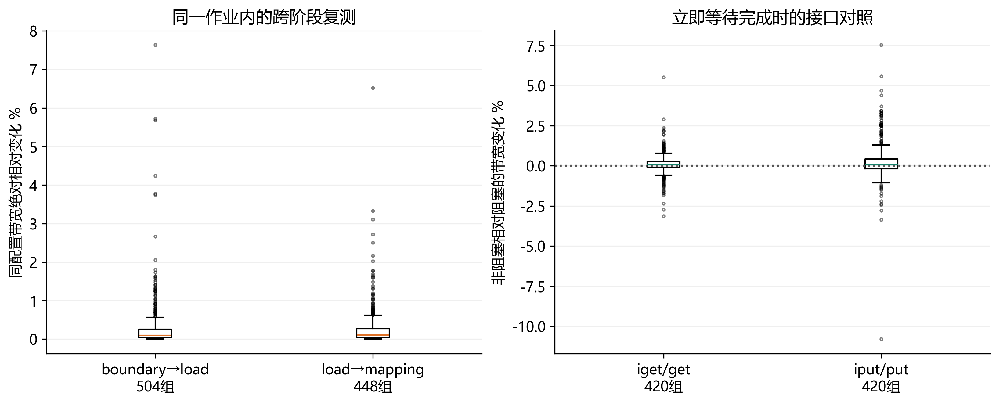
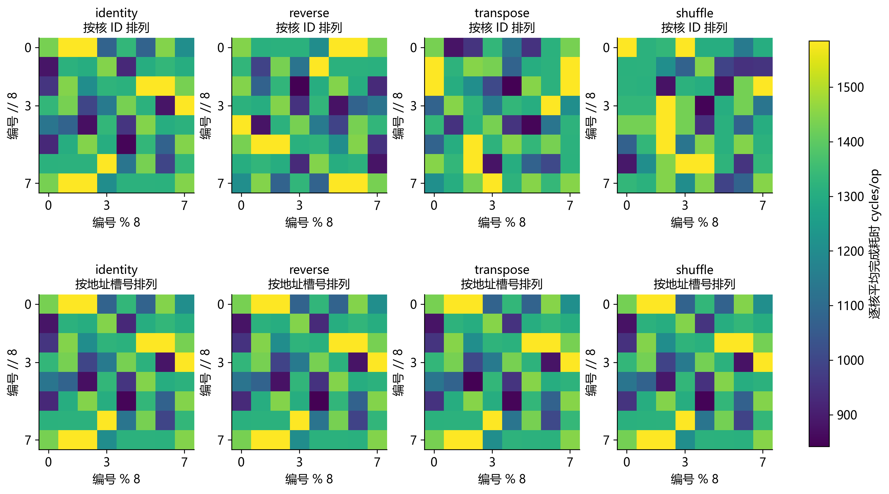

SW39000 DMA 扩展实验结果分析

实验日期 2026年10月5日    作业 8420952    队列 q_share

本实验测量一个核组内主存与从核 LDM 之间的 DMA，覆盖 8 B 至 128 KiB 消息、七档负载与多种地址布局。结果表明：128 B 对齐写入的边界显著，偏移代价随并发放大；大消息读取接近吞吐平台，写入则在较高核数下下降。读写开销、对齐条件和核到地址的对应关系应分别进入模型。

## 1  实验配置与数据复核

### 1.1  平台 接口与完整实验矩阵

主核 MPE 负责控制，从核 CPE 执行搬运；日志中的 SPE 也是从核标识。CG 为核组，本实验只使用一个 CG 的 64 个 CPE。LDM 为从核本地存储器；get/iget 将主存 src 读入 LDM，put/iput 将 LDM 写到独立主存 dst。非阻塞接口每次发起后立即等待，四种模式的软件请求窗口均为 W=1。

| 项目 | 本次记录 |
| --- | --- |
| 平台与编译 | cpu revision=sw39000  SPE 2250 MHz  MPE 2100 MHz swgcc/1473  GCC 7.1.0  目标 sw_64sw6a-sunway-linux-gnu |
| 编译选项 | 主核 -mhost -O2 -g  从核 -mslave -msimd -O2 -g 链接 -mhybrid -g |
| 资源与 LDM | MPE=1  CG=1  CPE=64  请求 -cache_size 0 静态 LDM 132840 B  共享 LDM 配置及资源独占程度未确认 |

| 阶段 | 大小数 | 偏移 B | 步长数×排列数 | 案例数 |
| --- | --- | --- | --- | --- |
| boundary 边界 | 9 | 0 4 64 124 | 1×1 | 1008 |
| load 负载 | 30 | 0 4 | 1×1 | 1680 |
| mapping 映射 | 8 | 0 4 | 4×4 | 7168 |

各阶段均包含 get、put、iget、iput 四种模式和 N=1、2、4、8、16、32、64 七档负载。N 表示计时的活跃核数，ID 固定为 0 至 N−1。边界组大小为 64、96、124、128、132、192、252、256、260 B。负载组的全部大小以 B 列出：8、16、32、64、96、124、128、132、192、252、256、260、384、512、768、1024、1536、2048、3072、4096、6144、8192、12288、16384、24576、32768、49152、65536、98304、131072。映射组大小为 64、128、256、4096、32768、65536、98304、131072 B。

### 数据复核

正式案例 9856 项，另有四种模式×1核或64核的 8 项正确性检查，大小 8 B、重复 10 次。独立交叉复核 179076 条活跃核记录与 8448 条扩展比及效率记录，计划、原始数据和汇总一致，errors 均为0，完成标记均记9856。

数据模式为 (tid×17+j×13+7) mod 256。读模式检查最后的 LDM 内容，写模式在 join 后检查主存 dst，计时循环记录接口返回错误。校验覆盖最终内容，未逐轮验证数据时序。q_share 名称本身不证明独占；平台参数也不直接迁移为 SW26010Pro 参数。

### 1.2  计时与完成条件

每项先预热 8 次，S<1 KiB 重复 R=10000 次，其余 R=1000 次。各核预热后同步，再用 athread_stime_cycle() 记录本地循环起止周期。计时包含调用、循环、返回码检查与完成等待；屏障、初始化、spawn/join、校验和输出位于计时区外。全部64核启动，非活跃核只参加计时区外的同步和结果回写。

| 指标 | 定义 |
| --- | --- |
| 逐核耗时 | Tᵢ=endᵢ−beginᵢ  tᵢ=Tᵢ/R |
| 汇总 cycles/op | tmax=max(Tᵢ)/R  取活跃核中最慢均值 |
| 聚合带宽 B/cycle | BW=N×S×R/max(Tᵢ)=N×S/tmax |
| 扩展比与效率 | Speedup=BW(N)/BW(1)  Efficiency=Speedup/N |
| 偏移耗时比 | tmax(offset)/tmax(0)  大于1表示偏移更慢 |

扩展比匹配模式、大小、偏移、步长与排列。聚合带宽采用最大本地累计周期，不直接相加各核带宽，也未另测全组共同起止时间；各核记录自身经过的周期，不要求绝对计数器起点同步。它是有效载荷吞吐，不含硬件协议及分段流量。

示例：boundary 的 128 B、64 核、对齐 put，R=10000，最大累计周期为 4,394,158，故 cycles/op=439.4158，BW=64×128/439.4158=18.6429 B/cycle。

### 单核小消息完成开销

| 模式 | 大小区间 | cycles/op 范围 | 中位数 cycles/op |
| --- | --- | --- | --- |
| get | 8至64 B | 441.06 至 441.36 | 441.11 |
| put | 8至64 B | 240.03 至 240.04 | 240.03 |
| iget | 8至64 B | 440.75 至 441.05 | 440.93 |
| iput | 8至64 B | 234.02 至 234.03 | 234.02 |

以上为 load 阶段、偏移0 B、默认步长和 identity 排列。读取约441 cycles，写入约234至240 cycles；没有扣除空循环，不能视为纯硬件启动延迟。供应方完成表示源 LDM 数据已取走，获取方完成表示目标 LDM 已收到；put/iput 不直接测量每轮最终 DRAM 提交延迟。

KiB=1024 B。原始周期与 B/cycle 为主要结果；仅当计数器按 SPE 2.25 GHz 递增时，ns=cycles÷2.25，十进制 GB/s=BW×2.25。计数器未独立标定，cpuinfo 的 timer frequency 100 Hz 不是此计数器频率。

### 1.3  主存槽布局与执行条件

槽是主存数组中供一个从核访问的逻辑区域。数据缓冲上限 C=131072 B，主存槽步长为相邻槽起点的距离，不等于每轮传输字节数 S。主存 src 和 dst 数组均按 128 B 对齐，分别分配 64×262144 B，即各 16 MiB；两者共 32 MiB，另有结果数组。

| 步长计算 | 步长 B | 128KiB 消息后的间隔 B |
| --- | --- | --- |
| C+128 | 131200 | 128 |
| C+256 | 131328 | 256 |
| C+4096 | 135168 | 4096 |
| 2C | 262144 | 131072 |

四种步长均是 128 B 的倍数，且足以容纳 128 KiB 数据及最大 124 B 偏移，避免槽间重叠。偏移只施加于主存地址，LDM 数据缓冲起点始终保持 128 B 对齐。因而对齐实验改变的是主存端起点。

| 排列名称 | 核 ID tid 对应的槽号 slot |
| --- | --- |
| identity | slot=tid |
| reverse | slot=63−tid |
| transpose | slot=(tid mod 8)×8+floor(tid/8) |
| shuffle | 固定种子 20261005 的 Fisher–Yates 排列 伪随机状态按源码的 32 位 xorshift 更新 |

逐核主存地址的计算式为 address=base+slot_of_pe[tid]×slot_stride+offset。get 使用 src，put 使用 dst；各案例 CSV 同时保存两端地址、slot 和映射名称，便于核对。两端基地址整个过程固定为 src=0x500001406000、dst=0x500002408000。

当 N=64、步长及偏移固定时，四种排列访问相同的 64 个地址，只改变哪个核访问哪个地址。这有助于区分固定核因素与核地址配对因素。当 N<64 时，只取排列中前 N 个核对应的槽，更换排列同时改变访问地址子集。

改变步长同时改变地址间距、页分布、访问范围等条件；不是单独改变已知物理 bank 的实验。虽然按 8×8 展示软件核 ID 或槽号便于识别模式，槽号二维排版不代表内存物理拓扑，虚拟地址也不能直接还原 DRAM channel 或 bank。

boundary 与 load 固定步长131200 B和 identity；mapping 改变步长与排列。源和目标主存数组一次分配，整个作业内基地址固定；每轮始终复用同一主存槽和 LDM 缓冲。一次作业内按 plan.csv 固定顺序执行三个阶段，shuffle 并未打乱运行顺序。

每核 LDM 数据缓冲为128 KiB、128 B对齐。手册描述 LDM 总容量256 KiB，可划分 Cache、私有和连续共享 LDM；本次 Cache 请求为0，实际共享分配量未知。链接报告静态 LDM 132840 B，未用 -b 搬移栈；本次运行完成不能保证其他内存配置也能容纳。

## 2  DMA 带宽曲线

默认布局下，单核吞吐随消息增大上升，64核大消息吞吐接近平台区。对齐读写表现不同：读取约20.85至20.98 B/cycle，写入约15.38至15.60 B/cycle。以下曲线同时显示1核与64核、主存偏移0 B与4 B，所有条件均来自 load 阶段。

图 1  四种 DMA 模式在两档核数与两种主存偏移下的聚合带宽

put/iput 的两个尖峰位于128 B和256 B，已用箭头标明，均为64核、偏移0 B的对齐写入。它们不是128 KiB附近的大消息峰值。横轴为以2为底的对数刻度，等距表示相同倍数，而非相同字节增量。尖峰来自完成耗时的局部低谷，具体硬件原因仍需区分。

### 128 KiB 对齐传输的代表结果

| 模式 | 单核 B/cycle | 64核 B/cycle | 64与1核带宽比 | 64核条件换算 GB/s |
| --- | --- | --- | --- | --- |
| get | 16.705 | 20.851 | 1.248 | 46.92 |
| put | 18.120 | 15.381 | 0.849 | 34.61 |
| iget | 16.704 | 20.864 | 1.249 | 46.94 |
| iput | 18.137 | 15.254 | 0.841 | 34.32 |

64至128 KiB的单核 get 带宽从 15.614 增至 16.705 B/cycle，增幅7.0%；put 增幅3.5%。扩大消息主要摊薄固定开销，未使大消息平台吞吐成倍增长。条件换算不替代频率标定；本结果适用于单核组、W=1、固定槽预热后访问，不代表全芯片峰值。

## 3  并发扩展与共享吞吐

### 3.1  消息大小决定并发收益

64核相对单核的带宽比在小消息下较高，随消息增大明显下降。理想线性扩展比为64，图中所有值都低于这一基准。写入还在128 B对齐处出现特殊高点，需要结合第4章的块边界分析。

图 2  64核相对单核的聚合带宽比  虚线接口为 iget 与 iput

| 消息大小 | get 对齐扩展比 | put 对齐扩展比 |
| --- | --- | --- |
| 8 B | 24.77 | 8.03 |
| 64 B | 24.71 | 8.02 |
| 128 B | 24.75 | 35.47 |
| 1 KiB | 9.07 | 3.99 |
| 4 KiB | 3.45 | 1.69 |
| 16 KiB | 1.83 | 1.06 |
| 32 KiB | 1.50 | 0.95 |
| 64 KiB | 1.34 | 0.89 |
| 128 KiB | 1.25 | 0.85 |

8 B对齐 get 扩展为 24.77 倍，128 KiB仅 1.25 倍。128 KiB put 扩展比为 0.849，64核聚合吞吐反而低于单核。效率为扩展比除以64，反映吞吐未随核数线性增长，不是应用计算效率。

### 3.2  七档核数定位饱和与下降区间

图 3  七档活跃核数的聚合吞吐  消息大小决定饱和和争用表现

| 活跃核数 | get 128KiB B/cycle | put 128KiB B/cycle | put 对4核 吞吐比 |
| --- | --- | --- | --- |
| 1 | 16.705 | 18.120 | 0.850 |
| 2 | 16.878 | 18.741 | 0.879 |
| 4 | 19.511 | 21.326 | 1.000 |
| 8 | 20.918 | 20.577 | 0.965 |
| 16 | 21.115 | 20.471 | 0.960 |
| 32 | 21.361 | 18.407 | 0.863 |
| 64 | 20.851 | 15.381 | 0.721 |

128 KiB 对齐 put 的本组最高值位于 4 核，为 21.326 B/cycle；64 核降至 15.381，比 4 核低 27.9%，也比单核低 15.1%。get 在 8 核已经达到该尺寸本组峰值的 95%，32 核最高，但 8、16、32、64 核之间只有几个百分点差异。

该结论针对固定活跃 ID 与默认槽步长。4 核 ID 为 0、1、2、3，并非几何 2×2 的 0、1、8、9；因此不能将 4 核峰值归因于小簇，也不能用于证明 RMA router 共享结构。

## 4  主存对齐与 128 B 写入边界

### 4.1  九种尺寸与四种偏移的边界细扫

主存端偏移均满足4 B接口约束，但改变相对于128 B边界的位置；LDM端始终128 B对齐。64核写入在128 B与256 B对齐处出现耗时低谷，相邻部分块尺寸明显较慢。

图 4  put 与 iput 的九种尺寸和四种偏移细扫  数值为 cycles/op

| 64核 put 消息 B | 偏移0 B | 偏移4 B | 偏移64 B | 偏移124 B |
| --- | --- | --- | --- | --- |
| 64 | 1916.82 | 3578.60 | 1913.48 | 3498.34 |
| 96 | 1917.49 | 3571.86 | 3503.49 | 5014.15 |
| 124 | 3577.09 | 3573.98 | 3504.05 | 3492.66 |
| 128 | 439.42 | 5179.92 | 3502.36 | 5008.27 |
| 132 | 2735.08 | 5166.38 | 5027.86 | 2684.06 |
| 192 | 2716.46 | 6690.86 | 2694.59 | 4582.60 |
| 252 | 4279.26 | 4376.84 | 4602.30 | 4589.93 |
| 256 | 885.38 | 6060.12 | 4590.04 | 6222.33 |
| 260 | 3521.90 | 6057.30 | 6169.40 | 3493.38 |

64 核对齐 put 的 128 B 耗时为 439.42 cycles/op，而相邻 124 B 与 132 B 分别为 3577.09 与 2735.08。256 B 对齐也出现同类低谷，说明转折并非简单的消息越大越慢。

### 4.2  偏移惩罚随并发放大

图 5  相同消息下偏移地址相对对齐地址的耗时比  虚线为 iput

| 模式与核数 | 消息 B | 偏移4 B 耗时比 | 偏移64 B 耗时比 | 偏移124 B 耗时比 |
| --- | --- | --- | --- | --- |
| put  1核 | 128 | 1.599 | 1.023 | 1.614 |
| put  64核 | 128 | 11.788 | 7.970 | 11.398 |
| put  1核 | 256 | 1.475 | 1.007 | 1.516 |
| put  64核 | 256 | 6.845 | 5.184 | 7.028 |
| get  64核 | 128 | 1.389 | 1.390 | 1.391 |

128 B 的 put 偏移 4 B 代价从单核约 1.60 倍放大到 64 核约 11.79 倍；后者带宽下降 91.5%。同尺寸 get 的 64 核偏移代价仅约 1.39 倍，读写路径需要分开解释。

### 仅靠覆盖的 128 B 块数仍不足以解释写入

64 B 偏移 0 B 与 96 B 偏移 4 B 都位于单个 128 B 地址块内，但 64 核 put 耗时分别约为 1916.82 和 3571.86 cycles/op，相差约 1.86 倍。另一方面，64 B 偏移 64 B 耗时约 1913.48 cycles/op，接近偏移 0 B。起点、终点及片段大小也影响写入，不能把额外覆盖一个块直接等价为固定惩罚。

这些现象支持对齐整块与部分块路径、并发争用等候选解释；目前未测硬件事务、bank/channel 或仲裁事件，尚不能确定是读改写、哪级缓存或某个互连部件导致。

## 5  操作完成耗时与非阻塞接口

### 5.1  完成耗时曲线与匹配接口比较

get 的单核小消息完成耗时较平稳；大消息下64核逐次完成耗时受共享吞吐约束。put 在64核、128 B对齐处明显下降，不能对全尺寸使用同一条线性延迟曲线。图中耗时取最慢核平均值，纵轴为对数刻度。

图 6  get 与 put 的完成耗时  对齐与偏移4 B的对照

| 核数 | 带宽比 | 60组配置的范围 | 中位数 |
| --- | --- | --- | --- |
| 1 | iget/get | 0.9951 至 1.0235 | 1.0010 |
| 1 | iput/put | 0.9757 至 1.0439 | 1.0034 |
| 64 | iget/get | 0.9957 至 1.0113 | 1.0006 |
| 64 | iput/put | 0.9917 至 1.0128 | 1.0000 |

每核比较包含30种大小×两种偏移。四种模式均逐次等待完成，因此 iget/iput 没有被用作流水线；比值接近1主要说明当前调用方式下差异较小。读写完成边界不同，不能直接把小消息基线差解释为 DRAM 读写物理延迟差。

### 测量边界

每配置只有一个独立计时区间，R次循环提高均值稳定性，不是R次独立实验；没有独立重复的置信区间。大消息平台、全尺寸的接口对照和单核小消息固定耗时应分别理解，不能互相替代。

### 5.2  同作业跨阶段复测的稳定程度

图 7  左为同配置跨阶段变化  右为匹配配置的非阻塞接口相对变化

| 匹配阶段 | 匹配组数 | 绝对变化中位数 | 绝对变化P90 | 绝对变化最大 |
| --- | --- | --- | --- | --- |
| boundary→load | 504 | 0.098% | 0.735% | 7.64% |
| load→mapping | 448 | 0.108% | 0.682% | 6.53% |

匹配项使用相同模式、大小、核数、偏移、默认步长和 identity 映射。绝对变化定义为 |BW后/BW前−1|。它们是同一作业内不同阶段的复测，执行顺序固定；虽显示多数配置相近，却不等价于独立作业重复、随机运行顺序或置信区间。几个百分点的细小差异应留待复测。

420 组匹配配置中，iget/get 带宽比中位数为 1.0006，iput/put 为 1.0005。非阻塞接口立即等待时，没有呈现稳定的整体吞吐优势；这不能用于评估多个未完成请求的流水收益。

| 匹配带宽比 | 最小值 | 中位数 | P90 | 最大值 |
| --- | --- | --- | --- | --- |
| iget/get | 0.9686 | 1.0006 | 1.0067 | 1.0551 |
| iput/put | 0.8920 | 1.0005 | 1.0211 | 1.0753 |

图 7 的箱线图汇集不同配置的变化分布，箱体、分位数与范围描述的是这批配置的异质性，不是同一配置多次独立测量的误差条。不能依据比值中位数接近1，声称接口在所有配置下性能完全相同；也不能从最大单点优势选择出普遍更快的接口。

## 6  逐核耗时与空间差异

### 6.1  小消息读取的模式跟随地址槽

图 8  get 256 B  64核  偏移0 B  步长131200 B  上排按核 下排按槽重排

| 映射对 identity | 按核ID的 Pearson r | 按地址槽的 Pearson r |
| --- | --- | --- |
| reverse | -0.1667 | 0.9999 |
| transpose | -0.0656 | 0.9996 |
| shuffle | -0.0895 | 0.9996 |

换映射后，按核 ID 观察的快慢模式明显改变；将同一组耗时重新按地址槽号排列后，三种映射均与 identity 高度一致。按槽的相关系数约为 0.9996 至 0.9999，按核约为 −0.17 至 −0.07。这个案例的主要逐核差异更倾向于与主存地址槽关联。

这里同一地址槽对应的是相同虚拟地址及同一进程中的缓冲区，已排除单纯由 tid 编号固定产生全部模式的解释。但尚无法区分内存映射、地址相关路由或其他与地址绑定的资源。大消息 get 的相关性更复杂，不能把本案例推广成所有读取都只由地址决定。

下排的 8×8 仅将槽号按 slot=8r+c 重新排版，不是内存的物理二维拓扑；上排也仅按软件核 ID 展示。Pearson r 是描述性相似度，不是独立重复的显著性检验。

相关系数按两组 64 项耗时的中心化乘积之和，除以各自中心化平方和乘积的平方根计算。r 接近1表示快慢变化线性同向，接近−1表示反向，接近0表示缺少线性一致性；它不要求绝对耗时相等。按槽比较前先把各核耗时重新放到它实际访问的 slot，避免把排列本身当成性能变化。

### 6.2  大消息写入保留核 ID 相关模式

图 9  put 128 KiB  64核  偏移0 B  步长131200 B
上排按核 下排按槽  色条单位为千 cycles/op

| 映射对 identity | 按核ID的 Pearson r | 按地址槽的 Pearson r |
| --- | --- | --- |
| reverse | 0.9998 | -0.8171 |
| transpose | 0.9789 | -0.0005 |
| shuffle | 0.9760 | -0.0890 |

这个写入案例中，换槽后上排的耗时模式仍相近：按核 ID 的相关系数为 0.9760 至 0.9998；按地址槽重排后，相似性反而减弱。与第 6.1 节的 256 B 读取相比较，它更支持核位置、注入或调度等与 CPE 绑定因素参与逐核差异。

吞吐与模式相似度应分开理解：即使各核的相对快慢排序相近，transpose 与 shuffle 的聚合吞吐仍低于 identity；地址配对仍能改变整体完成速度。固定核因素与地址因素可能同时存在，相关性并未证明具体部件或传输路线。

也不是所有 put 都呈现这一模式：例如 64 B 写入，reverse 与 identity 的按核相关系数约为 −0.81，按槽约为 0.83。写入应按消息规模和对齐条件分别分析，不能仅用一个“核位置惩罚”解释所有数据。

### 对体系结构建模的直接含义

建议至少区分读与写、整块与部分块、消息大小、活跃核集合、槽步长和映射。现阶段可以使用这些测量条件下的分段拟合或查表；跨布局或跨型号预测仍需验证。本实验没有发起 CPE 间 RMA，不能据此生成小簇通信参数。

### 6.3  槽布局同时改变聚合吞吐

逐核模式相似并不意味着聚合吞吐不变。下面固定64核与128 KiB消息，比较四种步长和四种排列，量化地址配对对整体完成速度的影响。

图 10  128 KiB 对齐消息的 64 核槽布局对照  所有排列复用相同缓冲基地址

| 模式 | 默认步长 identity | 默认步长 transpose | 262144 B identity | 16布局最大与 最小带宽比 |
| --- | --- | --- | --- | --- |
| get | 20.848 | 18.522 | 16.376 | 1.274 |
| put | 15.433 | 14.158 | 13.354 | 1.156 |

128 KiB、64 核 get 在默认步长的 identity 布局为 20.848 B/cycle，步长改为 262144 B 后为 16.376，下降 21.5%。固定默认步长但改为 transpose 后下降 11.2%；相应 put 下降 8.3%。

两端固定基地址分别为 0x500001406000 与 0x500002408000。64 核时固定步长下更换排列保持地址集合不变，仍出现吞吐差异，说明核到地址的配对关系参与了性能形成。核数小于 64 时排列也改变地址子集，应谨慎区分这两个因素。

改变步长会改变地址间距、页/地址集合和访问范围，不能视为已控制的物理 bank 实验。虚拟地址并不能确定实际 DRAM bank/channel；本数据支持布局敏感性，尚未定位具体映射函数。

## 7  初步建模参数与后续实验

### 7.1  对齐大消息的分段线性模型

默认步长131200 B、identity、偏移0 B下，拟合 T(S)=α+βS。T为汇总 cycles/op，S为字节数。单核取1至128 KiB的8个倍增点，64核取4至128 KiB的6个倍增点；分别拟合四种模式。表中的斜率吞吐为 N/β，α为区间外推截距，均不是直接测得的硬件常数。

| 模式 | 核数 | α cycles | β cycles/B | 斜率吞吐 B/cycle | R² |
| --- | --- | --- | --- | --- | --- |
| get | 1 | 502.45 | 0.056130 | 17.82 | 0.999956 |
| get | 64 | 263.77 | 3.063333 | 20.89 | 0.999985 |
| put | 1 | 246.76 | 0.053321 | 18.75 | 0.999999 |
| put | 64 | -344.04 | 4.151956 | 15.41 | 0.999934 |
| iget | 1 | 496.47 | 0.056122 | 17.82 | 0.999967 |
| iget | 64 | 294.89 | 3.061620 | 20.90 | 0.999987 |
| iput | 1 | 240.83 | 0.053305 | 18.76 | 1.000000 |
| iput | 64 | -1041.52 | 4.187128 | 15.28 | 0.999870 |

高 R² 表明所选大消息区间总体接近线性，不说明小消息或其他布局也适用。64核 put/iput 的负截距是区间外推结果，不代表负延迟；α也不应替代读取约441 cycles的小消息平台。β反映当前负载、布局与串行等待下的有效传输斜率，不是单链路理论带宽。模型不能跨过128 B部分块边界直接预测写入。

| 核数 | get 最大相对拟合误差 | put 最大相对拟合误差 |
| --- | --- | --- |
| 1 | 3.51% | 0.87% |
| 64 | 3.97% | 5.09% |

相对误差按 |预测/实测−1| 在拟合点上取最大值，是样本内误差，不是独立验证误差。大消息点主导R²，区间低端仍可能有偏差。模型建议分别保存小消息固定开销、按大小与偏移划分的写入表，以及按核数和槽布局条件化的大消息斜率。

本次关键经验值为：128 B、64核 put 偏移4 B耗时约增至11.79倍；128 KiB对齐 put 的4核观测峰值21.326 B/cycle、64核15.381；同尺寸 get 在8核已接近平台区。逐核相关性支持分开考虑地址槽与核因素，但没有确定具体路由或bank机制。

### 7.2  后续实验与数据依据

### 已经完成与仍需补充的测量

| 实验项目 | 本次状态 | 下一步 |
| --- | --- | --- |
| 边界与偏移 | 9种大小×4种偏移 | 独立重复关键边界及片段对照 |
| 中间负载 | 七档核数 | 固定可比地址集合轮换活跃核 |
| 地址布局 | 4步长×4排列 | 结合物理地址或硬件事件定位机制 |
| 独立重复与顺序 | 单作业固定顺序 | 多次独立作业并随机化顺序 |
| 资源与内存配置 | Cache请求0  共享程度未知 | 记录分配、同节点作业与实际LDM划分 |
| 请求窗口与工作集 | W=1  固定地址复用 | 独立缓冲扫W并轮转主存工作集 |
| 计数器频率 | 尚未独立标定 | 与可信时间基准交叉标定 |

先复测写入边界、4核与64核的大消息差异及两类逐核模式，再测请求窗口和轮转工作集。改变槽间距不是工作集轮转，固定种子的shuffle也不是执行顺序随机化。DMA没有发起CPE间RMA，本结果不能生成2×2小簇router参数；后者需要独立RMA拓扑实验。

### 数据与手册依据

数据集为 dma_results_20261005_203552_32484：plan.csv和slot_maps.csv定义条件与排列；raw及smoke保留原始记录；study_summary.csv与study_scaling.csv保留汇总和扩展；source为运行版本，build_info.txt、build.log、cpuinfo.txt和job.log为配置依据。所有图表和模型均使用本次数据。

手册依据：《SACA编程指南》v0.62，PDF第59页说明128 B主存请求拆分，第60页定义完成条件，第88页定义从核计数器；《神威众核编程指南》2.4.2、3.4、4.1、4.3节说明内存与接口。分段描述与观测一致，但额外分段不足以单独解释11.79倍惩罚。

### 复核与生成入口

远端运行入口为 DMA_MAX_BYTES=131072 bash run_dma_boundary.sh q_share。对已有结果做分析无需提交新作业；在项目根目录执行：

python bench/analyze_dma_study.py dma_results_20261005_203552_32484 --out outputs/dma_study_analysis_20261005_203552_32484

分析目录保存完整性、边界、负载、布局、阶段差异和相关性衍生表。结构对齐版的模型参数另存同目录 model_fits_128k.csv；本报告目录的 _build/draw_aligned_charts.py 和 build_aligned_report.py 生成编号图表与正文。

适用范围为本次SW39000环境、单CG、W=1、固定槽预热后访问。其他Cache/LDM配置、活跃位置、轮转工作集、型号或共享状态下，应复测后再迁移。
