SW39000 DMA 测试数据报告

实验日期 2026年10月5日    作业8420952    数据集 dma_results_20261005_203552_32484

## 1  测试条件与指标

测量一个核组内主存与从核本地存储器 LDM 之间的搬运。get/iget 为主存 → LDM；put/iput 为 LDM → 主存。四种模式均逐次等待完成，软件未完成请求窗口 W=1。

| 条件 | 取值 |
| --- | --- |
| 平台与编译 | cpu revision=sw39000；swgcc/1473；主核 -mhost -O2 -g，从核 -mslave -msimd -O2 -g，链接 -mhybrid -g |
| 资源与内存 | 1个MPE、1个CG、64个CPE；q_share；Cache请求0；共享LDM和实际独占程度未记录 |
| 活跃核 | N=1、2、4、8、16、32、64；活跃ID=0至N−1 |
| 数据缓冲 | LDM数据缓冲128 KiB，128 B对齐；静态LDM132840 B；主存源、目标数组各16 MiB |
| 计时 | 8次预热；S<1 KiB重复10000次，其余1000次；屏障、初始化、校验、输出不计时 |
| 默认布局 | 主存槽步长131200 B；identity映射；每轮复用同一主存槽与LDM缓冲 |

| 实验分组 | 消息大小数量 | 主存偏移 B | 步长×映射数量 | 案例数 |
| --- | --- | --- | --- | --- |
| 边界细扫 | 9 | 0、4、64、124 | 1×1 | 1008 |
| 负载扫描 | 30 | 0、4 | 1×1 | 1680 |
| 槽布局对照 | 8 | 0、4 | 4×4 | 7168 |

共9856个正式案例、8个正确性检查；179076条活跃核记录，原始与汇总数据一致，errors均为0。

主要结果：128 B、64核 put 偏移4 B的耗时为对齐的11.79倍；128 KiB对齐 put 在4核为21.326 B/cycle、64核为15.381；128 KiB get 的64核带宽受槽布局影响，步长翻倍后下降21.5%。

### 1.1  消息大小 地址布局与单位

KiB=1024 B。偏移仅作用于主存端，LDM起点始终128 B对齐。

边界细扫：64、96、124、128、132、192、252、256、260 B。负载扫描：8、16、32、64、96、124、128、132、192、252、256、260、384、512、768、1024、1536、2048、3072、4096、6144、8192、12288、16384、24576、32768、49152、65536、98304、131072 B。槽布局对照：64、128、256 B及4、32、64、96、128 KiB。

| 布局参数 | 定义 |
| --- | --- |
| 槽步长 | 131200、131328、135168、262144 B；每槽可容纳最大消息和偏移，各核槽不重叠 |
| identity | slot=tid |
| reverse | slot=63−tid |
| transpose | slot=(tid mod 8)×8+floor(tid/8) |
| shuffle | 种子20261005的固定随机排列；改变核到槽的对应，不改变运行顺序 |
| 主存地址 | address=base+slot×stride+offset；src基址0x500001406000，dst基址0x500002408000 |

| 指标 | 计算方式 |
| --- | --- |
| 完成耗时 cycles/op | 核i累计周期Tᵢ；重复次数R；汇总耗时t=max(Tᵢ)/R |
| 聚合带宽 B/cycle | BW=N×消息字节数/t；采用活跃核中最慢本地累计周期 |
| 扩展比 | 相同模式、大小、偏移、布局下，BW(N)/BW(1) |
| 偏移耗时比 | t(offset)/t(0)；大于1表示偏移更慢 |

计数器未独立标定，报告保留cycles与B/cycle。get完成表示数据已进入目标LDM；put完成表示源LDM数据已取走。耗时包含接口、循环与等待开销。当前数据为同一作业内固定顺序测量，不提供独立重复的置信区间。

## 2  DMA 读取带宽

负载扫描；默认布局；30种消息大小；蓝色为1核，橙色为64核，虚线为主存偏移4 B。

图 1  get 与 iget 的读取吞吐  横轴采用对数刻度，各刻度明确标注B或KiB

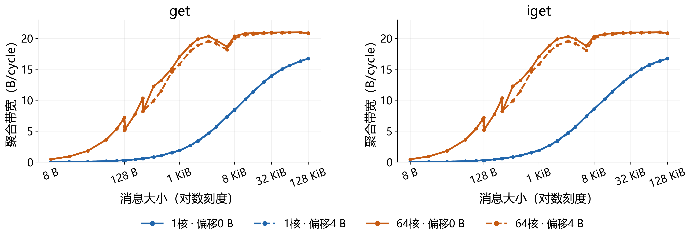

| 模式 | 64KiB单核 | 128KiB单核 | 64KiB 64核 | 128KiB 64核 | 128KiB扩展比 |
| --- | --- | --- | --- | --- | --- |
| get | 15.614 | 16.705 | 20.955 | 20.851 | 1.248 |
| iget | 15.717 | 16.704 | 20.957 | 20.864 | 1.249 |

表中带宽单位均为B/cycle。64核 get 在32至128 KiB约20.85至20.98 B/cycle；单核 get 从64至128 KiB增加7.0%。

### 2.1  DMA 写入带宽

负载扫描；默认布局；两个标注峰值位于128 B与256 B。128 KiB是最右端的大消息测点。

图 2  put 与 iput 的写入吞吐  峰值尺寸直接用箭头标注

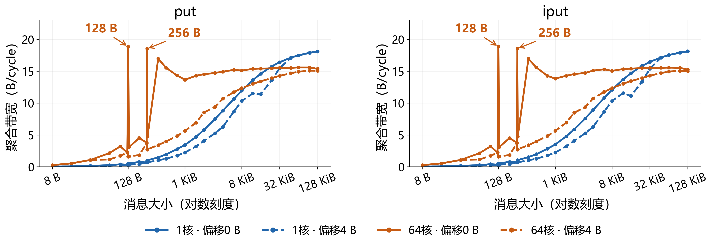

| 模式 | 128B 64核 | 256B 64核 | 128KiB单核 | 128KiB 64核 | 128KiB扩展比 |
| --- | --- | --- | --- | --- | --- |
| put | 18.886 | 18.530 | 18.120 | 15.381 | 0.849 |
| iput | 18.882 | 18.550 | 18.137 | 15.254 | 0.841 |

表中带宽单位均为B/cycle。put在124、128、132 B的完成耗时为3570.67、433.75、2731.73 cycles/op；128 B局部耗时低谷形成带宽高峰。

## 3  并发扩展与共享吞吐

负载扫描；64核聚合带宽除以单核带宽；get与put分色，虚线水平参考值为1。

图 3  64核相对单核的带宽收益  左为偏移0 B，右为偏移4 B

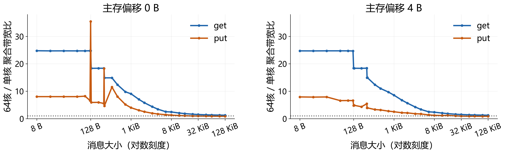

| 大小 | get对齐扩展比 | put对齐扩展比 | get偏移4 B | put偏移4 B |
| --- | --- | --- | --- | --- |
| 8 B | 24.77 | 8.03 | 24.72 | 7.92 |
| 128 B | 24.75 | 35.47 | 18.39 | 4.77 |
| 1 KiB | 9.07 | 3.99 | 8.56 | 2.51 |
| 4 KiB | 3.45 | 1.69 | 3.36 | 1.71 |
| 64 KiB | 1.34 | 0.89 | 1.34 | 0.85 |
| 128 KiB | 1.25 | 0.85 | 1.24 | 0.83 |

小消息 get 的对齐扩展约24.77倍，128 KiB为1.25倍；128 KiB put 为0.85倍，即64核聚合吞吐低于单核。理想线性扩展值为64。

### 3.1  七档活跃核数的聚合带宽

负载扫描；128 KiB；主存偏移0 B；默认槽布局；活跃ID为0至N−1。

图 4  128 KiB的get与put吞吐  每个柱顶直接标出B/cycle

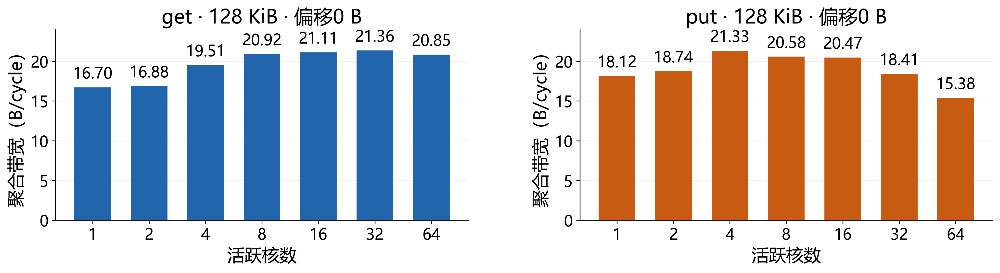

| 活跃核数 | get 4KiB | get 64KiB | get 128KiB | put 4KiB | put 64KiB | put 128KiB |
| --- | --- | --- | --- | --- | --- | --- |
| 1 | 5.702 | 15.614 | 16.705 | 8.810 | 17.502 | 18.120 |
| 2 | 10.562 | 17.478 | 16.878 | 17.449 | 18.736 | 18.741 |
| 4 | 15.633 | 19.655 | 19.511 | 20.104 | 21.204 | 21.326 |
| 8 | 20.095 | 20.892 | 20.918 | 19.582 | 20.441 | 20.577 |
| 16 | 19.457 | 21.315 | 21.115 | 17.846 | 20.530 | 20.471 |
| 32 | 20.689 | 21.466 | 21.361 | 16.959 | 18.767 | 18.407 |
| 64 | 19.649 | 20.955 | 20.851 | 14.931 | 15.601 | 15.381 |

表中单位为B/cycle。128 KiB put 在4核为21.326，64核下降至15.381，降低27.9%；get在8核为20.918，接近32核的21.361。4核ID为0、1、2、3。

## 4  主存对齐与写入边界

边界细扫；1个活跃核；9种尺寸×4种主存偏移；默认槽布局。

图 5  1核put与iput完成耗时  格内数值为cycles/op，四舍五入到整数；色标为线性刻度

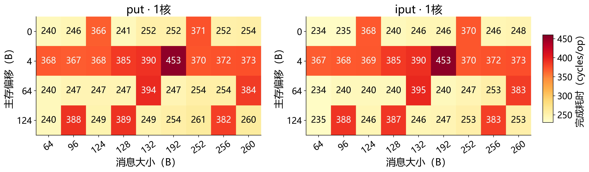

| 模式 | 消息 B | 偏移0 B | 偏移4 B | 偏移64 B | 偏移124 B |
| --- | --- | --- | --- | --- | --- |
| put | 128 | 241.00 | 385.33 | 246.50 | 388.96 |
| put | 256 | 252.15 | 371.84 | 254.02 | 382.20 |
| iput | 128 | 240.01 | 385.27 | 240.11 | 387.21 |
| iput | 256 | 246.04 | 371.83 | 252.51 | 382.59 |

表中为cycles/op。单核128 B put 偏移4 B后从241.00增至385.34，约1.60倍；256 B由252.15增至371.84，约1.47倍。

### 4.1  64核写入边界

边界细扫；64个活跃核；9种尺寸×4种主存偏移；默认槽布局。

图 6  64核put与iput完成耗时  格内数值为cycles/op，四舍五入到整数；色标为对数刻度

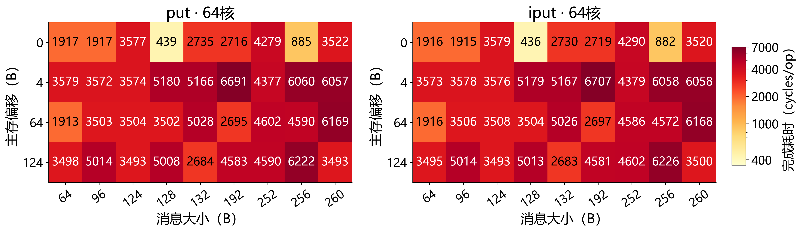

| 模式 | 消息 B | 偏移0 B | 偏移4 B | 偏移64 B | 偏移124 B |
| --- | --- | --- | --- | --- | --- |
| put | 128 | 439.42 | 5179.92 | 3502.36 | 5008.27 |
| put | 256 | 885.38 | 6060.12 | 4590.04 | 6222.33 |
| iput | 128 | 435.96 | 5178.91 | 3503.85 | 5012.72 |
| iput | 256 | 882.47 | 6057.77 | 4572.29 | 6226.44 |

表中为cycles/op。128 B和256 B的对齐写入明显快于相邻部分块尺寸；64核时偏移惩罚放大，put和iput呈现一致的边界。

### 4.2  偏移惩罚随活跃核数变化

边界细扫；128 B与256 B；耗时比取同模式、同大小、同核数下的偏移值除以对齐值。

图 7  写入偏移耗时比  颜色对应偏移，实线put、虚线iput

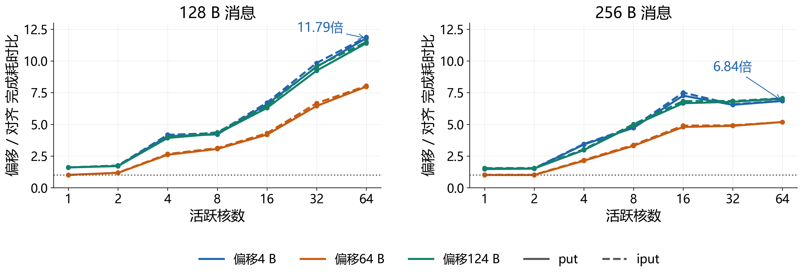

| 模式与核数 | 大小 B | 偏移4 B耗时比 | 偏移64 B耗时比 | 偏移124 B耗时比 |
| --- | --- | --- | --- | --- |
| put · 1核 | 128 | 1.599 | 1.023 | 1.614 |
| put · 64核 | 128 | 11.788 | 7.970 | 11.398 |
| put · 64核 | 256 | 6.845 | 5.184 | 7.028 |
| get · 64核 | 128 | 1.389 | 1.390 | 1.391 |

128 B、64核 put 偏移4 B耗时增至11.79倍，带宽下降91.5%；同尺寸 get 为1.39倍。单个128 B块内的不同起点与片段大小也会影响写入，不能仅按覆盖块数解释。

## 5  操作完成耗时与非阻塞接口

负载扫描；默认布局；1核与64核；偏移0 B与4 B；纵轴为对数刻度。

图 8  get与put的完成耗时  单位cycles/op，取活跃核中最慢平均值

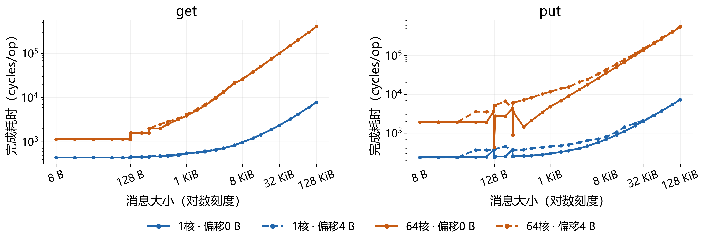

| 模式 | 单核8至64B最小值 | 单核8至64B中位数 | 单核8至64B最大值 |
| --- | --- | --- | --- |
| get | 441.06 | 441.11 | 441.36 |
| put | 240.03 | 240.03 | 240.04 |
| iget | 440.75 | 440.93 | 441.05 |
| iput | 234.02 | 234.02 | 234.03 |

表中条件为主存对齐，单位cycles/op。单核小消息读取约441，put约240，iput约234；包含循环和等待开销，完成语义不等同于最终DRAM写入延迟。

### 5.1  阻塞与非阻塞接口的匹配数据

每档核数匹配30种大小×两种偏移，共60组。iget与iput每次发起后立即等待，W=1。

| 核数 | iget/get最小 | iget/get中位数 | iget/get最大 | iput/put最小 | iput/put中位数 | iput/put最大 |
| --- | --- | --- | --- | --- | --- | --- |
| 1 | 0.9951 | 1.0010 | 1.0235 | 0.9757 | 1.0034 | 1.0439 |
| 2 | 0.9686 | 0.9997 | 1.0194 | 0.8920 | 1.0010 | 1.0467 |
| 4 | 0.9879 | 1.0016 | 1.0221 | 0.9664 | 0.9999 | 1.0753 |
| 8 | 0.9819 | 1.0011 | 1.0217 | 0.9856 | 1.0009 | 1.0271 |
| 16 | 0.9726 | 1.0016 | 1.0551 | 0.9763 | 0.9996 | 1.0371 |
| 32 | 0.9844 | 1.0000 | 1.0216 | 0.9912 | 1.0003 | 1.0298 |
| 64 | 0.9957 | 1.0006 | 1.0113 | 0.9917 | 1.0000 | 1.0128 |

带宽比大于1表示非阻塞接口更快。全部420组的iget/get中位数为1.0006，iput/put为1.0005；当前逐次等待方式下，两类接口的整体吞吐接近。

### 同配置跨阶段的带宽变化

| 阶段对照 | 匹配配置数 | 绝对变化中位数 | 绝对变化P90 | 绝对变化最大值 |
| --- | --- | --- | --- | --- |
| boundary → load | 504 | 0.098% | 0.735% | 7.637% |
| load → mapping | 448 | 0.108% | 0.682% | 6.526% |

绝对变化=|BW后/BW前−1|；匹配模式、大小、核数、偏移和默认布局。该表比较同一作业的不同阶段，不是独立作业重复的误差条。

## 6  逐核耗时与空间差异

槽布局对照；get；256 B；64核；偏移0 B；步长131200 B。三个面板使用相同色标。

图 9  identity与reverse的逐核模式  前两图按核ID排列，第三图按实际地址槽重排

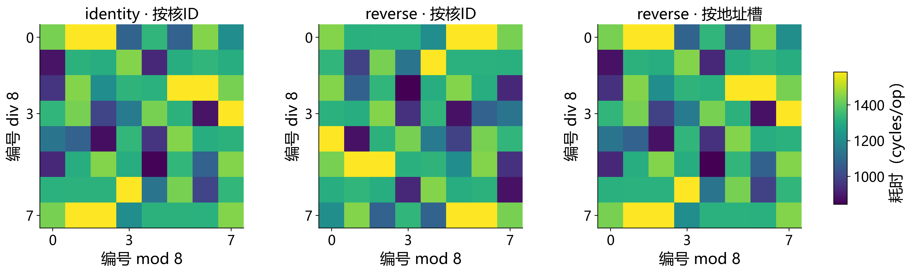

| 相对identity的映射 | 按核ID相关系数r | 按地址槽相关系数r |
| --- | --- | --- |
| reverse | -0.1667 | 0.9999 |
| transpose | -0.0656 | 0.9996 |
| shuffle | -0.0895 | 0.9996 |

读取256 B时，换核访问同一槽后，按槽的快慢模式保持一致，r=0.9996至0.9999；按核ID模式改变。

r为64项耗时的Pearson线性相关系数；槽的8×8排列是编号展示，不表示内存物理拓扑。

### 6.1  大消息写入的逐核差异

槽布局对照；put；128 KiB；64核；偏移0 B；步长131200 B。三个面板使用相同色标。

图 10  identity与reverse的逐核模式  前两图按核ID排列，第三图按实际地址槽重排

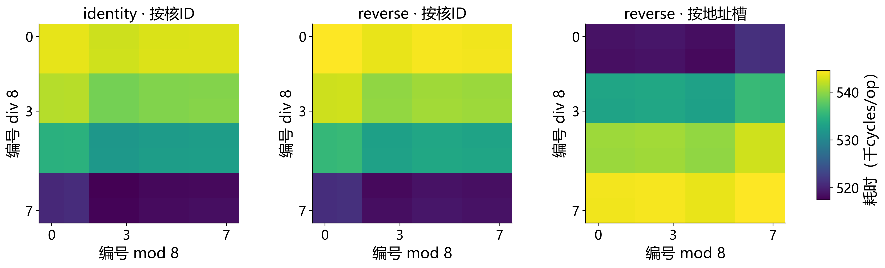

| 相对identity的映射 | 按核ID相关系数r | 按地址槽相关系数r |
| --- | --- | --- |
| reverse | 0.9998 | -0.8171 |
| transpose | 0.9789 | -0.0005 |
| shuffle | 0.9760 | -0.0890 |

写入128 KiB时，换槽后按核ID的快慢模式仍相近，r=0.9760至0.9998；按槽重排后的相关性明显减弱。

r为64项耗时的Pearson线性相关系数；槽的8×8排列是编号展示，不表示内存物理拓扑。写入色标单位为千cycles/op。

### 6.2  槽步长和核到槽排列的吞吐差异

槽布局对照；128 KiB；64核；偏移0 B。固定步长时，四种排列使用相同地址集合。

图 11  get与put在16种槽布局下的聚合带宽  格内数值及色标单位均为B/cycle

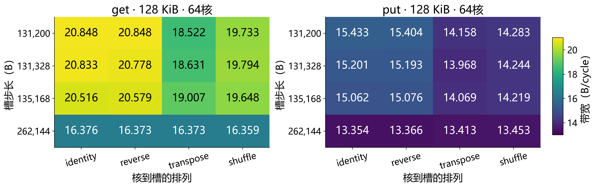

| 模式 | 131200 B identity | 131200 B transpose | 262144 B identity | 16布局最大/最小 |
| --- | --- | --- | --- | --- |
| get | 20.848 | 18.522 | 16.376 | 1.274 |
| put | 15.433 | 14.158 | 13.354 | 1.156 |
| iget | 20.849 | 18.506 | 16.368 | 1.274 |
| iput | 15.380 | 14.183 | 13.358 | 1.151 |

get的identity步长由131200增至262144 B，吞吐由20.848降至16.376，降低21.5%；同一步长改为transpose后降低11.2%。虚拟地址布局影响吞吐，但未确定物理bank或路由机制。

## 7  大消息拟合参数

默认布局；偏移0 B；模型T(S)=α+βS，T为cycles/op，S为B；斜率吞吐=N/β。

| 模式 | 核数 | 拟合大小区间 | 点数 | α cycles | β cycles/B | N/β B/cycle | R² | 最大相对误差 |
| --- | --- | --- | --- | --- | --- | --- | --- | --- |
| get | 1 | 1至128 KiB | 8 | 502.45 | 0.056130 | 17.82 | 0.999956 | 3.51% |
| get | 64 | 4至128 KiB | 6 | 263.77 | 3.063333 | 20.89 | 0.999985 | 3.97% |
| put | 1 | 1至128 KiB | 8 | 246.76 | 0.053321 | 18.75 | 0.999999 | 0.87% |
| put | 64 | 4至128 KiB | 6 | -344.04 | 4.151956 | 15.41 | 0.999934 | 5.09% |
| iget | 1 | 1至128 KiB | 8 | 496.47 | 0.056122 | 17.82 | 0.999967 | 2.68% |
| iget | 64 | 4至128 KiB | 6 | 294.89 | 3.061620 | 20.90 | 0.999987 | 2.71% |
| iput | 1 | 1至128 KiB | 8 | 240.83 | 0.053305 | 18.76 | 1.000000 | 0.80% |
| iput | 64 | 4至128 KiB | 6 | -1041.52 | 4.187128 | 15.28 | 0.999870 | 7.18% |

单核采用1、2、4、8、16、32、64、128 KiB；64核采用4、8、16、32、64、128 KiB。最大相对误差为拟合点上的|预测/实测−1|。

64核put/iput负截距是大消息区间外推结果，不是负物理延迟。该线性模型描述对齐大消息；128 B和256 B附近的边界需要保留各尺寸与偏移的实测数据。

### 代表数据

| 测量条件 | get | put | 单位 |
| --- | --- | --- | --- |
| 单核8至64 B固定耗时 | 约441 | 约240 | cycles/op |
| 128 KiB、1核、对齐 | 16.705 | 18.120 | B/cycle |
| 128 KiB、4核、对齐 | 19.511 | 21.326 | B/cycle |
| 128 KiB、64核、对齐 | 20.851 | 15.381 | B/cycle |
| 128 B、64核、偏移4 B/对齐 | 1.389 | 11.788 | 耗时比 |
