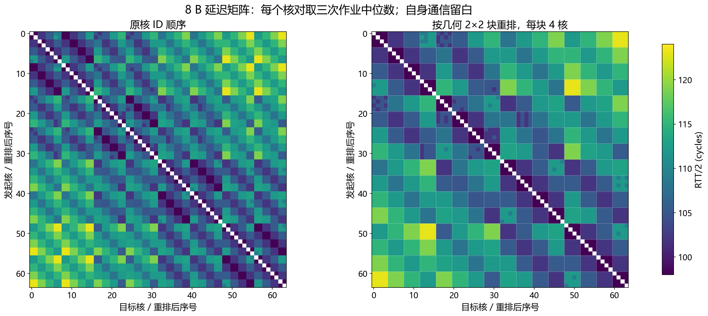
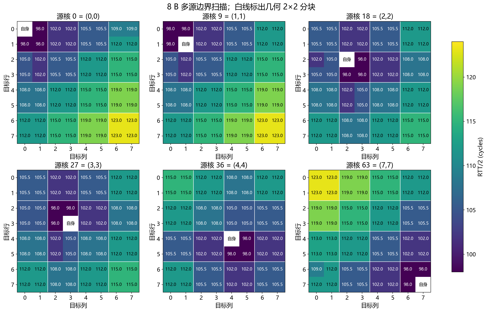
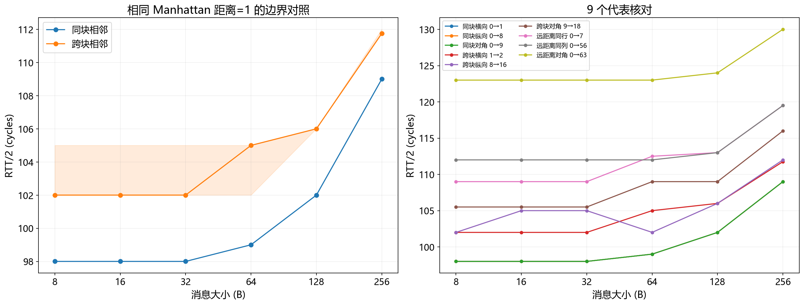
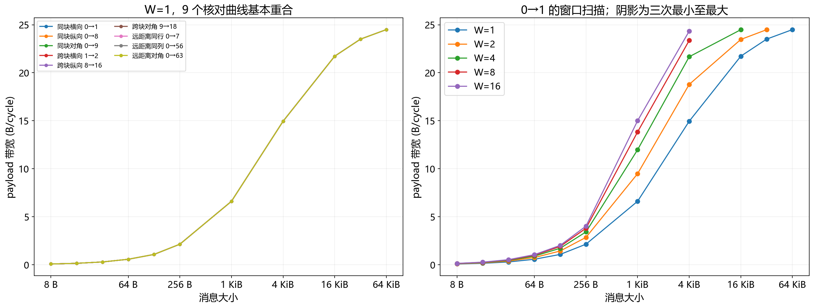
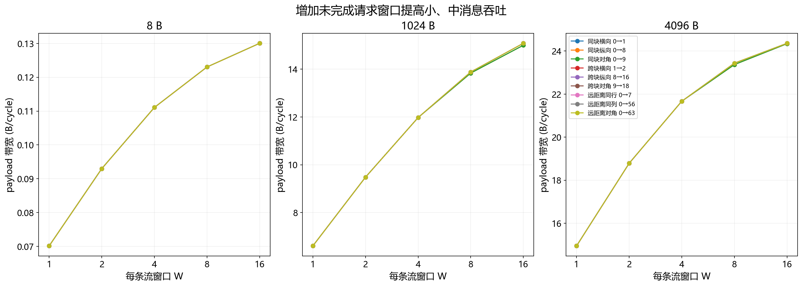
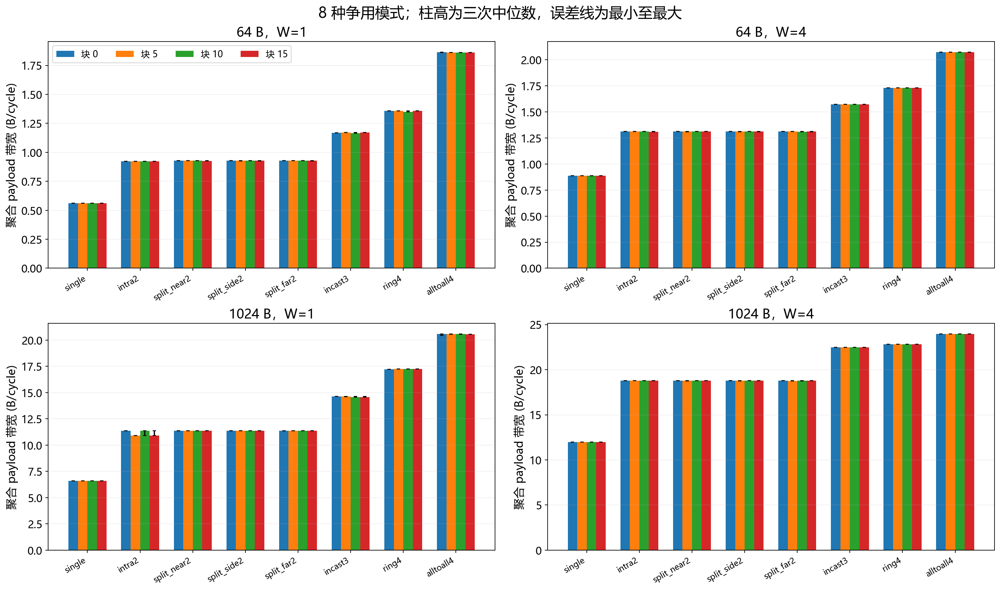
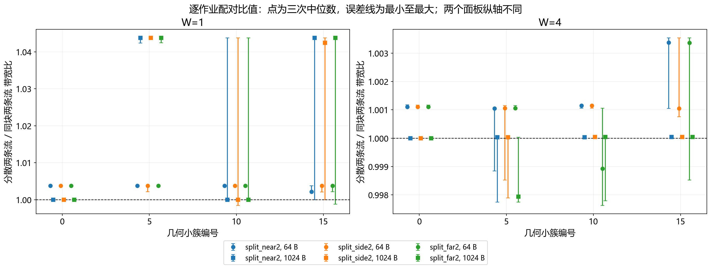
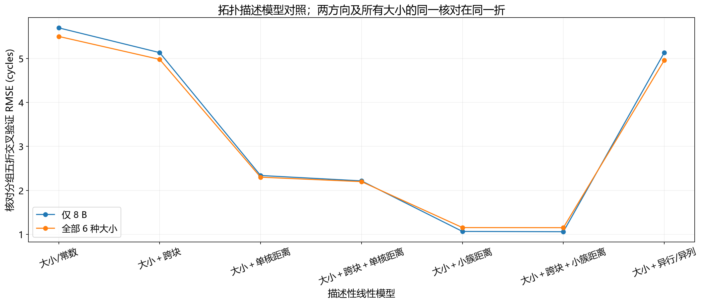

# SW39000 RMA 微基准结果分析

数据目录：`rma_results_20261006_194029_17374`。以下性能统计只使用 `phase=raw`，先对同一配置取三次作业中位数。

## 1. 主要结果

1. **小消息延迟出现可测的 2×2 几何边界。**8 B 同块的 192 个有向核对全部为 98.002 cycles。核距同为一格时，同块相邻为 98.002 cycles，跨块相邻的中位数为 102.0025 cycles，增加约 4.0005 cycles（4.08%）。这控制了单核 Manhattan 距离，较直接地支持 2×2 分块与延迟的关联。
2. **距离效应主要体现在小簇坐标尺度。**8 B 用小簇行列距离拟合的 R²=0.9649，核对分组交叉验证 RMSE=1.067 cycles；单核行列距离模型 R²=0.8314、RMSE=2.339 cycles。数据支持在描述性延迟模型中保留小簇层次，但没有直接测量物理路由。
3. **点对点带宽差异很小。**九个核对在 64 KiB、W=1 时均为 24.499 B/cycle；测试范围内最高中位数约 24.508 B/cycle。同块、跨块和远距离在这组带宽测试中没有明显惩罚。
4. **窗口带来的增益比核对位置差异大。**0→1，1024 B 从 W=1 的 6.606 增至 W=16 的 14.999 B/cycle，约 2.27 倍。
5. **本轮没有出现分散两条流后吞吐成倍恢复的现象。**W=4、1024 B 时，分散/同块带宽比中位数接近 1；W=1 的 1024 B 有位置相关差异，不能仅用跨位置汇总的约 2.1% 增益概括全部小簇。

## 2. 平台、测试范围和数据核对

| 项目 | 本次记录 |
|---|---|
| CPU | `/proc/cpuinfo`：sw39000 |
| 编译器 | swgcc/1473；target=sw_64sw6a-sunway-linux-gnu |
| 三次计算节点 | vn024481, vn024481, vn024481 |
| 作业 | 8433994、8433995、8433997，顺序提交，正式配置顺序打乱 |
| 资源请求 | 1 MPE、1 CG、64 CPE；cache=0 KiB |
| 实际独占、共享 LDM、实际 cache/LDM | 未确认，q_share 名称不能证明 |
| 缓冲容量 | 两个 RMA LDM 缓冲各 65536 B；静态 LDM 133736 B 告警 |
| 频率记录 | spe=2250 MHz，mpe=2100 MHz；RMA 计数器频率未独立标定 |
| 正式配置 | 每次 548 项，三次共 1644 项；另有每次 18 项 smoke |

已逐文件核对 1698 个原始 CSV：检查行数、完整核对集合、几何分类、活跃核集合、错误数，以及原始数据与顶层汇总的一致性。4032 个非自身有向核对×6 种大小×3 次=**72576 条正式延迟记录**；542 项带宽/争用配置×3 次=**1626 条正式聚合记录**。所有现有校验的 errors 为 0，计时为正，聚合指标与逐核最大耗时一致。

正确性检查等待 reply 并检查最终缓冲，源数据模式每 256 B 重复。它不能证明每次中间传输的每个字节均已验证。报告保留 cycles 和 B/cycle；不把 cpuinfo 的 2250 MHz 直接当作已校准计数器频率，也不把 linux 的 timer frequency=100 Hz 当作 CPE 计数器频率。

### 测量定义

- **延迟**：4 次预热后计时 2000 次 ping-pong，L=总 RTT 周期/(2×2000)，包括 RMA 接口、reply 等待和对端响应。阵列 barrier 在计时外。RTT/2 混合两个方向的性能，不能作为纯单向链路延迟。
- **带宽**：RMA iput；一轮预热后，每条流传输 2000 次。BW=bytes×reps×flows/活跃核最大周期数。包含发起循环、本地和远端完成等待。多流各核计时区始于共同 barrier 后，但读取本核周期差，取最大周期差不等同于跨核同步测得全局墙钟跨度。
- **窗口**：每条流每批发起 W 次，再等本地完成；独立窗口槽在下一批复用。alltoall4 每核有 3 条出流，最多 3W 个请求；目标为各入流分配独立 lane。每个目标满足 bytes×W×入流数≤65536。
- **几何**：id=8r+c，簇编号=4 floor(r/2)+floor(c/2)。此处“同块/跨块”是几何分组；router、共享管理部件和物理跳数未直接观测。

## 3. 延迟矩阵和小簇边界

### 3.1 全矩阵与多源热图



左图保持核 ID 顺序，右图把同一 2×2 块的四核放在一起。自身通信留白。每个像素是该有向核对三次作业中位数，而不是行/列平均值。



六个源核使用同一色标。白线标出几何块界。源位于不同位置时，低延迟区随源的几何小簇移动；较远位置总体耗时增加。

### 3.2 固定单核距离的一格边界对照

| bytes | same_cluster | row_distance | count | min | median | mean | max |
| --- | --- | --- | --- | --- | --- | --- | --- |
| 8 | 0 | 0 | 48 | 102.0023 | 102.0025 | 102.2524 | 105.0020 |
| 8 | 0 | 1 | 48 | 102.0023 | 102.0025 | 102.8148 | 105.0020 |
| 8 | 1 | 0 | 64 | 98.0020 | 98.0020 | 98.0020 | 98.0020 |
| 8 | 1 | 1 | 64 | 98.0020 | 98.0020 | 98.0020 | 98.0020 |

same_cluster=1 为同块，0 为跨块；row_distance=0 为横向，1 为纵向。count 是不同有向核对数，不是独立作业数。每核对先取三次中位数。

同块相邻横向和纵向均为 98.002 cycles。跨块相邻两类的中位数相同，为 102.0025 cycles，但均值与最大值不同，说明不同边界位置仍有差异。跨块样本最高到 105.002 cycles，不能给所有边界统一指定 4-cycle 的精确代价。

8 B 全部跨块核对的中位数为 112.002 cycles。这包含更远距离，不能直接将其与同块的差值解释成纯边界惩罚。



左图阴影表示不同核对三次中位数的空间最小值至最大值，不是独立重复的误差区间。

### 3.3 消息大小与代表核对

| bytes | min | median | mean | max |
| --- | --- | --- | --- | --- |
| 8 | 98.002 | 108.001 | 109.046 | 123.002 |
| 16 | 98.002 | 108.001 | 109.045 | 123.002 |
| 32 | 98.002 | 108.001 | 109.045 | 123.002 |
| 64 | 99.005 | 109.002 | 110.106 | 123.004 |
| 128 | 102.002 | 109.004 | 111.741 | 124.005 |
| 256 | 108.997 | 116.002 | 117.760 | 130.008 |

上表分布来自 4032 个核对的三次中位数。8～32 B 整体分布接近；64～256 B 逐步上升。代表核对如下，单位为 cycles：

| initiator | peer | 8 | 16 | 32 | 64 | 128 | 256 |
| --- | --- | --- | --- | --- | --- | --- | --- |
| 0 | 1 | 98.002 | 98.002 | 98.002 | 99.005 | 102.002 | 109.002 |
| 0 | 8 | 98.002 | 98.002 | 98.002 | 99.005 | 102.002 | 109.002 |
| 0 | 9 | 98.002 | 98.002 | 98.002 | 99.005 | 102.002 | 109.002 |
| 1 | 2 | 102.002 | 102.002 | 102.002 | 105.002 | 106.002 | 111.752 |
| 8 | 16 | 102.002 | 105.002 | 105.002 | 102.006 | 106.002 | 112.002 |
| 9 | 18 | 105.505 | 105.505 | 105.505 | 109.002 | 109.004 | 116.002 |
| 0 | 7 | 109.002 | 109.002 | 109.002 | 112.502 | 113.002 | 119.502 |
| 0 | 56 | 112.002 | 112.002 | 112.002 | 112.002 | 113.002 | 119.502 |
| 0 | 63 | 123.002 | 123.002 | 123.002 | 123.002 | 124.005 | 130.006 |

0→1、0→8、0→9 在 8 B 下均为 98.002 cycles，同块对角也没有额外代价。1→2 为 102.003；9→18 为 105.506；0→7、0→56、0→63 分别为 109.002、112.002、123.002 cycles。行列不能完全互换。个别核对在增大消息后耗时反而稍降，例如 8→16 的 32 B 为 105.002、64 B 为 102.006；这说明简单的统一 α+βS 不会精确解释每个测点，不能把变化直接换算成负的字节传输代价。

## 4. 点对点带宽和请求窗口



左图仅 W=1，右图给出 0→1 的窗口曲线。只画实际运行过的容量合法配置，64 KiB 没有 W>1 测点。曲线重叠是数据现象，没有为了展示而人为错开。

0→1 的三次中位数如下，单位 B/cycle。空白表示容量限制下未测量：

| bytes | 1 | 2 | 4 | 8 | 16 |
| --- | --- | --- | --- | --- | --- |
| 8 | 0.0702 | 0.0930 | 0.1111 | 0.1230 | 0.1300 |
| 16 | 0.1403 | 0.1860 | 0.2222 | 0.2461 | 0.2601 |
| 32 | 0.2807 | 0.3720 | 0.4443 | 0.4921 | 0.5201 |
| 64 | 0.5613 | 0.7440 | 0.8886 | 0.9843 | 1.0403 |
| 128 | 1.0665 | 1.4219 | 1.7062 | 1.8957 | 2.0072 |
| 256 | 2.1330 | 2.8438 | 3.4124 | 3.7914 | 4.0144 |
| 1024 | 6.6056 | 9.4796 | 11.9737 | 13.8339 | 14.9990 |
| 4096 | 14.9478 | 18.7872 | 21.6695 | 23.3695 | 24.3417 |
| 16384 | 21.7288 | 23.4721 | 24.4895 | 未测 | 未测 |
| 32768 | 23.5061 | 24.4899 | 未测 | 未测 | 未测 |
| 65536 | 24.4992 | 未测 | 未测 | 未测 | 未测 |

64 KiB、W=1 九个核对均为 24.499247 B/cycle。九个核对在相同消息与窗口下的最大空间差异为 0.552%，与小消息延迟约 4-cycle 的边界差异形成两种不同测量结果。点对点曲线不能直接外推为全 CG 或全芯片理论总带宽。



8 B 的 W=1→16 增益为 1.853 倍，1024 B 为 2.271 倍。4096 B 的窗口同样提高吞吐。窗口增大把发起/等待开销分摊到多次传输，但当前窗口有限，数据不能单独确定硬件队列深度或绝对 outstanding 上限。

## 5. 小簇争用与流量分散

A/B/C/D 为 2×2 块中左上、右上、左下、右下。single：A→B；intra2：A→B 与 C→D；split 三类：两条流分别位于不同块内部；incast3：B/C/D→A；ring4：A→B→D→C→A；alltoall4：四核之间 12 条有向流。split 不是一条跨块流，与跨块单流核对测试的意义不同。



以下表先对各配置取三次中位数，再跨四个块取中位数，单位 B/cycle。它用于概览，不把 4 个位置当作增加的独立作业重复：

| bytes | window | single | intra2 | split_near2 | split_side2 | split_far2 | incast3 | ring4 | alltoall4 |
| --- | --- | --- | --- | --- | --- | --- | --- | --- | --- |
| 64 | 1 | 0.5613 | 0.9239 | 0.9274 | 0.9274 | 0.9274 | 1.1692 | 1.3578 | 1.8605 |
| 64 | 4 | 0.8886 | 1.3111 | 1.3125 | 1.3125 | 1.3125 | 1.5718 | 1.7309 | 2.0730 |
| 1024 | 1 | 6.6056 | 11.1376 | 11.3765 | 11.3765 | 11.3765 | 14.5879 | 17.2489 | 20.5642 |
| 1024 | 4 | 11.9736 | 18.7847 | 18.7854 | 18.7854 | 18.7854 | 22.4899 | 22.8014 | 23.9476 |

两条流相对 single 不达到理想的 2 倍，例如 1024 B、W=4 时 single≈11.974、intra2≈18.785，为约 1.569 倍。但是分散流量也约为 18.785，说明“两条流缩放不足”本身不能归因于同一小簇 router 独有的共享瓶颈。发起循环、端点路径或更大范围共享资源都可能参与，当前数据不能将它们分开。

### 5.1 同块两条流与不同块两条流



每个比值先匹配同一作业、大小、W 和起始块，再计算 split/intra2。下表的 min/max 跨三次与四个位置共 12 个配对比值，**不是置信区间**：

| bytes | window | split_case | min | median | max |
| --- | --- | --- | --- | --- | --- |
| 64 | 1 | split_far2 | 1.002188 | 1.003797 | 1.003800 |
| 64 | 1 | split_near2 | 1.001956 | 1.003793 | 1.003800 |
| 64 | 1 | split_side2 | 1.002130 | 1.003797 | 1.003800 |
| 64 | 4 | split_far2 | 0.997629 | 1.001079 | 1.003538 |
| 64 | 4 | split_near2 | 0.998844 | 1.001105 | 1.003538 |
| 64 | 4 | split_side2 | 0.998527 | 1.001102 | 1.003543 |
| 1024 | 1 | split_far2 | 0.998807 | 1.021248 | 1.043781 |
| 1024 | 1 | split_near2 | 1.000019 | 1.021188 | 1.043781 |
| 1024 | 1 | split_side2 | 0.998483 | 1.021243 | 1.043781 |
| 1024 | 4 | split_far2 | 0.997749 | 1.000016 | 1.000073 |
| 1024 | 4 | split_near2 | 0.997749 | 1.000037 | 1.000073 |
| 1024 | 4 | split_side2 | 0.997895 | 1.000041 | 1.000073 |

64 B、W=1 分散约快 0.38%；1024 B、W=1 的汇总中位数约快 2.1%，范围从略低于 1 到约 1.044。W=4、1024 B 的中位数接近 1.0000，部分重复略低。应保留位置与重复，不应把约 2.1% 写成所有小簇的一致收益。

下表保留 1024 B、W=1 的逐块绝对带宽，单位 B/cycle：

| cluster_index | alltoall4 | incast3 | intra2 | ring4 | single | split_far2 | split_near2 | split_side2 |
| --- | --- | --- | --- | --- | --- | --- | --- | --- |
| 0 | 20.569374 | 14.625890 | 11.376229 | 17.226043 | 6.605557 | 11.376451 | 11.376451 | 11.376451 |
| 5 | 20.564159 | 14.624776 | 10.899270 | 17.248930 | 6.605557 | 11.376451 | 11.376451 | 11.376451 |
| 10 | 20.564159 | 14.551035 | 11.376008 | 17.248930 | 6.605557 | 11.376451 | 11.376451 | 11.376451 |
| 15 | 20.543960 | 14.551035 | 10.899270 | 17.248930 | 6.605557 | 11.376451 | 11.376451 | 11.376451 |

intra2 存在约 10.899 和 11.376 B/cycle 两个观测水平；同一块在不同作业中也可能切换，不能将跨位置差异完全看作固定空间结构。下面保留每次作业的数据：

| cluster_index | 1 | 2 | 3 |
| --- | --- | --- | --- |
| 0 | 11.376229 | 11.376229 | 11.376229 |
| 5 | 10.899270 | 10.899270 | 10.899270 |
| 10 | 11.376008 | 11.376008 | 10.899270 |
| 15 | 10.899270 | 11.376008 | 10.899270 |

split 三类较接近。原始逐核耗时已保存到 `tables/active_pe_timings.csv`；这些模式同时改变端点位置和流组合，不能仅从吞吐比反推出一个物理 router 的端口结构。

### 5.2 incast、ring、all-to-all

在 1024 B、W=4 的跨块位置概览中，incast3≈22.490、ring4≈22.801、alltoall4≈23.948 B/cycle。alltoall4 的流数为 12，不是 4；其吞吐约为 single 的 2 倍，远低于理想 12 倍。各模式的端点复用、发起循环次数和每核 outstanding 数也不同，不能将这些比值当作严格只改变流数的等条件扩展实验。

## 6. 重复性与描述模型

### 6.1 三次观测的变化

range_pct=(最大值−最小值)/中位数×100%，统计单位是匹配配置。延迟匹配每个大小和有向核对，带宽匹配所有计划参数。

| metric | configurations | median_range_pct | p90_range_pct | max_range_pct |
| --- | --- | --- | --- | --- |
| latency | 24192 | 0.000000 | 0.000000 | 0.000000 |
| bandwidth_pair | 414 | 0.000265 | 0.000769 | 0.000813 |
| contention | 128 | 0.000362 | 0.231232 | 4.374042 |

六个大小的正式延迟矩阵在三次作业中不仅数值相同，原始文件 SHA-256 也分别完全相同（每种大小的唯一哈希数均为 1）。这是输入文件中的事实。它使这批数据无法提供非零的作业间延迟散布估计，不能据此证明单次测量无噪声或所有机器都稳定。三次均在 vn024481，且提交紧邻，只代表该节点这一短时间范围。

点对点带宽匹配配置的跨作业极差很小。争用的最大跨作业极差约 4.374%，因此要同时查看逐块和逐次结果。最大波动的配置见下表：

| case | bytes | window | cluster_index | median | min | max | range_pct |
| --- | --- | --- | --- | --- | --- | --- | --- |
| intra2 | 1024 | 1 | 15 | 10.899270 | 10.899270 | 11.376008 | 4.374042 |
| intra2 | 1024 | 1 | 10 | 11.376008 | 10.899270 | 11.376008 | 4.190737 |
| alltoall4 | 1024 | 1 | 0 | 20.569374 | 20.443287 | 20.569374 | 0.612983 |
| ring4 | 64 | 1 | 10 | 1.350029 | 1.350029 | 1.357809 | 0.576273 |
| incast3 | 1024 | 1 | 15 | 14.551035 | 14.551035 | 14.624776 | 0.506773 |
| incast3 | 1024 | 1 | 10 | 14.551035 | 14.551035 | 14.624776 | 0.506773 |

### 6.2 8 B 模型对照

定义 hx=|cs−cd|，hy=|rs−rd|；bx=|floor(cs/2)−floor(cd/2)|，by=|floor(rs/2)−floor(rd/2)|。bx/by 是小簇坐标距离，不能未经验证称作物理 hop。cross=不同小簇指示量。

| model | parameters | r2 | rmse_cycles | cv_rmse_cycles |
| --- | --- | --- | --- | --- |
| 常数 | 1 | 0.0000 | 5.6953 | 5.6953 |
| 跨块指示量 | 2 | 0.1880 | 5.1320 | 5.1321 |
| 单核坐标距离 | 3 | 0.8314 | 2.3387 | 2.3387 |
| 跨块＋单核距离 | 4 | 0.8486 | 2.2163 | 2.2164 |
| 小簇坐标距离 | 3 | 0.9649 | 1.0670 | 1.0671 |
| 跨块＋小簇距离 | 4 | 0.9653 | 1.0605 | 1.0606 |
| 是否同行/同列 | 3 | 0.1873 | 5.1342 | 5.1342 |

对 4032 个有向核对的三次中位数做最小二乘拟合。交叉验证按无向核对划为五折，同一核对的两方向及所有大小留在同一折；它测试留出核对的预测误差，不是跨节点验证。所有模型细节及 6 种大小联合线性模型保存在 `tables/models.csv`。

小簇坐标距离模型：

```text
L_8B ≈ 98.480 + 3.965 bx + 4.355 by       (cycles)
```

加入跨块指示量后：

```text
L_8B ≈ 98.002 + 0.611 cross + 3.924 bx + 4.315 by
```

后者 RMSE≈1.060 cycles，比前者≈1.067 改善很小。只用 cross 的模型解释力很弱（R²≈0.188），因为它把所有跨块远近关系压成同一类。最有用的结构描述是小簇坐标尺度上的距离，加上近端基线；单个固定的“跨簇惩罚”不足以描述完整矩阵。



## 7. 对“小簇是否应进入模型”的回答

**延迟层面有数据依据。**同核距的边界对照、随源移动的热图和小簇距离模型共同支持显式保留 2×2 几何层次。可从约 98-cycle 的同块小消息基线和以小簇坐标计算的距离项开始描述本次测量。

**带宽和共享资源层面的证据较弱。**九个代表核对的大消息吞吐接近，分散两条流没有带来明显的大幅恢复。可报告 W=1 条件下的小幅位置差异及 W=4 近乎相同的结果；不能把“文档中的共享部件”直接变成一个本次已确认的强带宽瓶颈。

**物理片上通信路径尚未确定。**这些 microbenchmark 约束了成本随几何距离、消息大小、窗口和流组合如何变化，未观测实际路由或端口。报告中的模型是本机、本内核和本次配置下的经验描述。

## 8. 图表和数据依据

- `figures/`：8 张 PNG 大图及 SVG 矢量图。
- `tables/latency_repeats.csv`：全部核对的三次中位数、最小、最大、极差。
- `tables/bandwidth_repeats.csv`：全部带宽与争用配置的三次统计。
- `tables/paired_contention_ratios.csv`、`contention_ratios_by_block.csv`：逐作业配对及逐块对照。
- `tables/models.csv`：描述模型系数和留出预测误差。
- `tables/raw_file_audit.csv`：逐原始 CSV 的 SHA-256；源结果文件未修改。

分析依据包括顶层 summary.csv/latency.csv、各 repeat 的 plan.csv、全部 raw/smoke CSV、资源记录、build_info.txt 及随结果保存的主从核源码。
